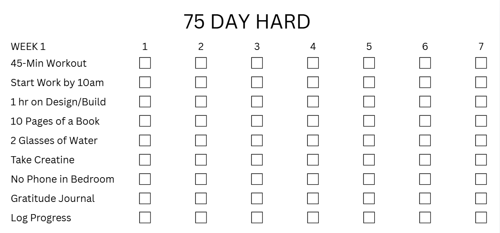
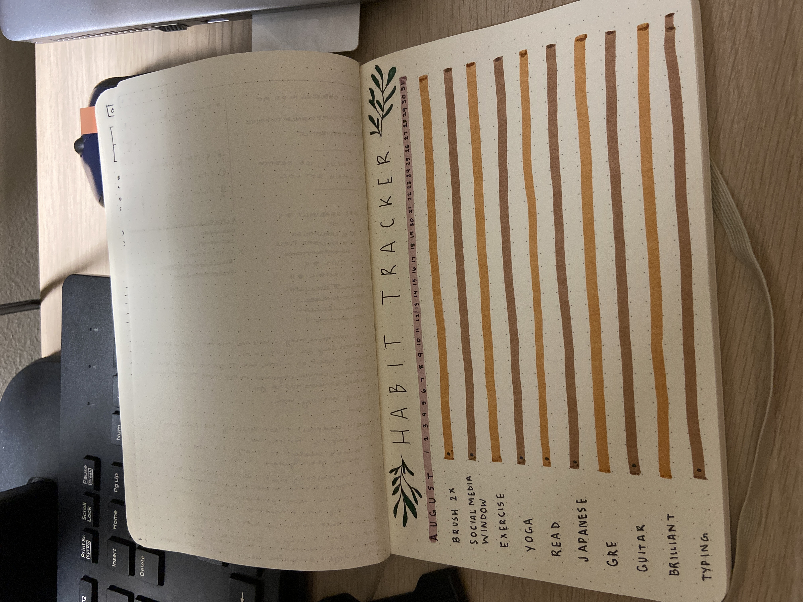
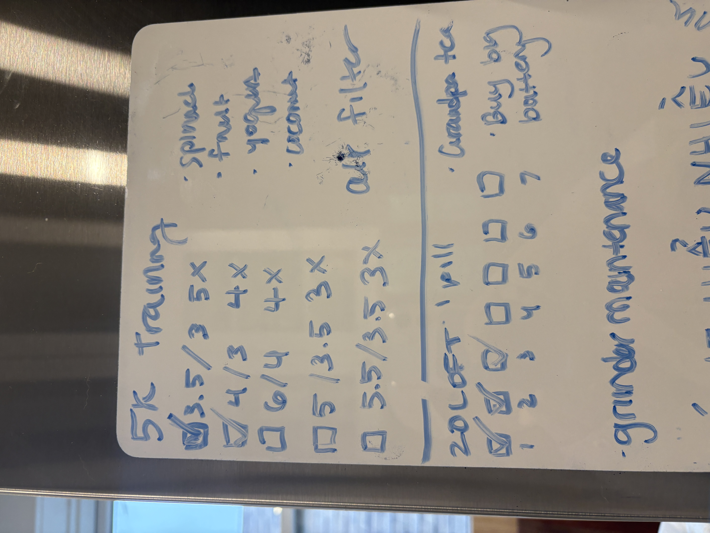

## why?

***at this moment in time, i've decided that there's nothing holding me back from doing my best***; the ["edge of my abilities"](https://www.recurse.com/self-directives). as i've talked about in a previous blog post, what "my best" looks like can fluctuate each day, so it's hard to measure. in my corporate job, my manager, N, asked me,  "if you were to be honest with yourself and the work you are doing right now, are you proud of yourself?". reminded of this, i think that if i can show up every day in some capacity, it can allow me to at least have a record that i tried to set up the ideal conditions for me to do my best work. these ideal conditions involve taking care of my body and mental health, as well as setting up structures to better manage my work.

## how?

so, i've decided to challenge myself for the next 75 days to show up for these habits:
- **45-min workout everyday**
    - weight training or gym class, run, dance, or a rest day 1-2 days a week
- **start working by 10am**
    - this is totally feasible because my earliest class is 12pm, i have my laptop on me, and i previously started my job at 7-9am every morning
- **spend 1 hour on designing/building a passion project**
    - right now i have various coding and fabrication projects in/outside of school that i'm working on. i want to carve out a delibrate 1 hour of meaningful, heads-down work a day
- **read 10 pages of a book**
- **drink 2 glasses of water**
- **take creatine**
- **no phone in the bedroom**
    - i just ordered an alarm clock to decouple that task from my phone. i want to force myself to exit my room in order to use my phone; it's just way too comfy to use it in my room, especially my bed.
- **gratitude journal**
    - list 5 things i'm grateful for every day
- **log progress**
    - seems redundant to have this as a tally but i mean to set an intention to journal about my progress privately

i made this chart to track it:

i'm going to print it out and paste it on my wall.

in the standard 75 hard challenge it requires a daily progress photo but that's not my thing, especially with how my modification is not exactly fully physical-health-oriented. i'd like to write/film a weekly recap. it'll be fun to gamify this process and share my progress.

Today is DAY 0 and i've managed to do everything besdies read 10 pages of a book, which i'll do before bed tonight. i've been reading "God in a Cup: The Obsessive Quest for the Perfect Coffee"
by Michaele Weissman. lowkey boring but that's exactly the sort of book you need before bed.

## old habit trackers

throwback to when i bullet journaled in undergrad when i took much pride in being disciplined and a woman in STEM (2018-2022):

fast forward to 2025 when i tracked my 5k training on my dingy fridge whiteboard:

