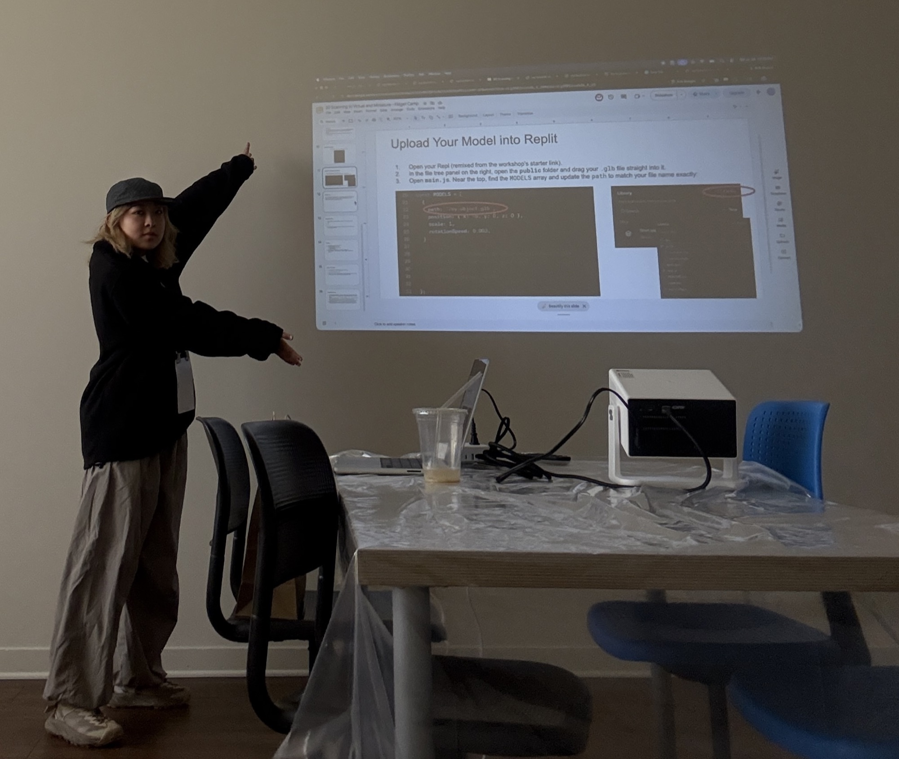
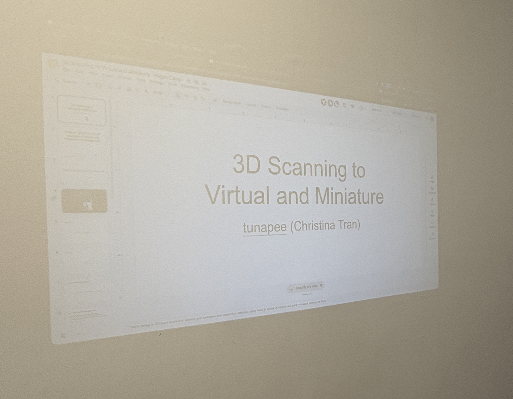
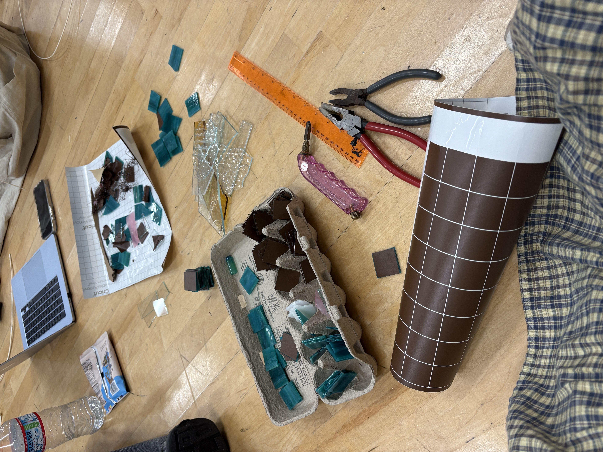
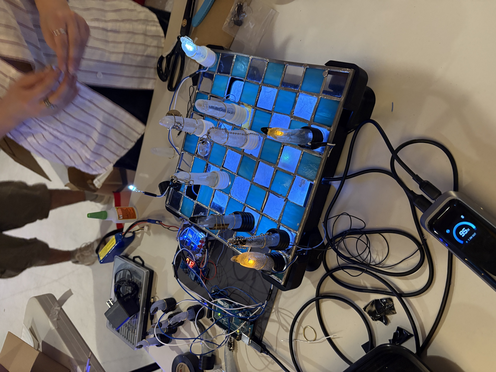
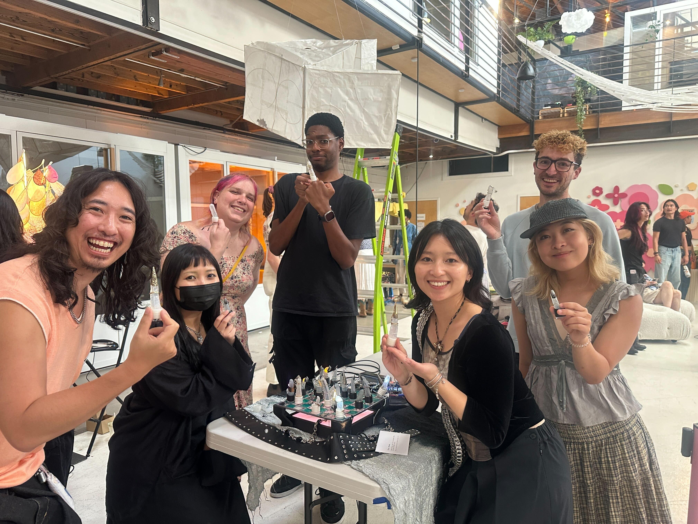
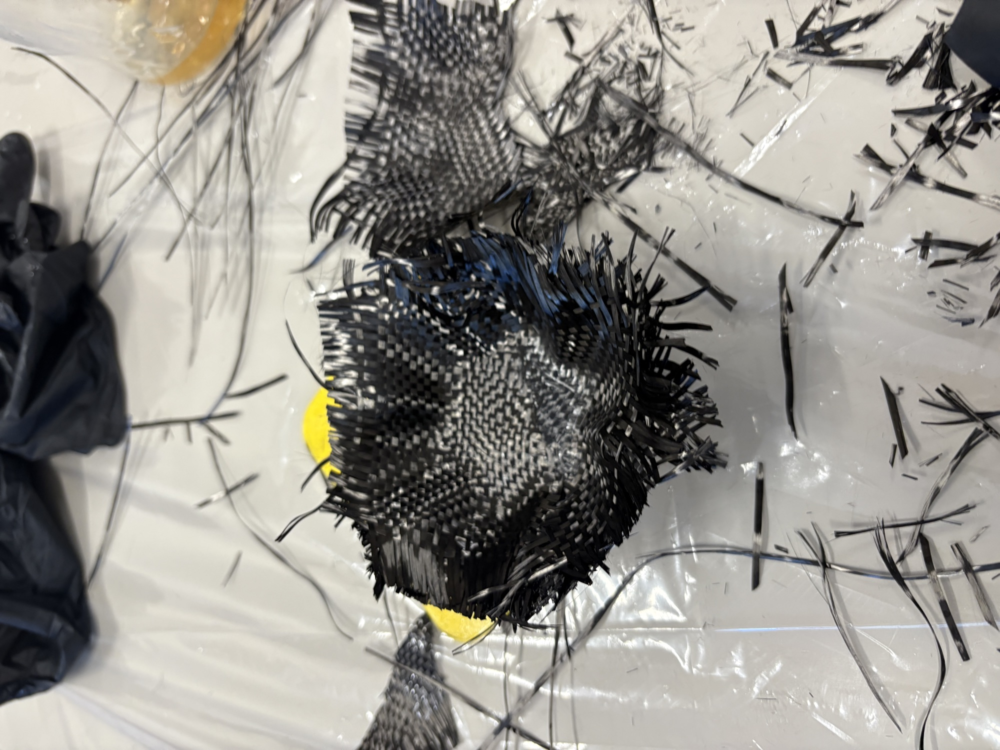
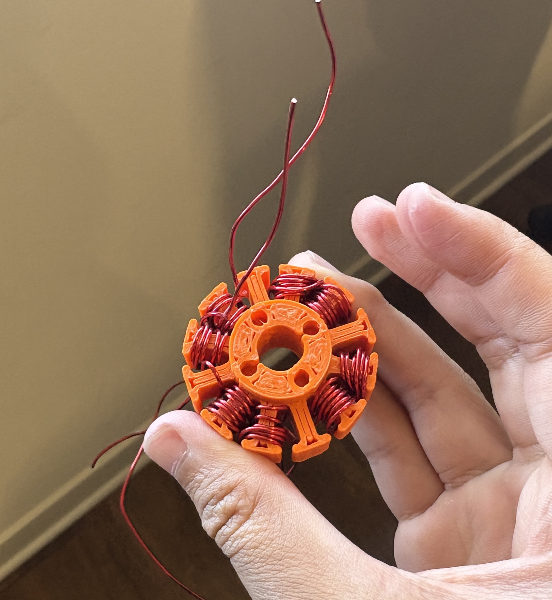
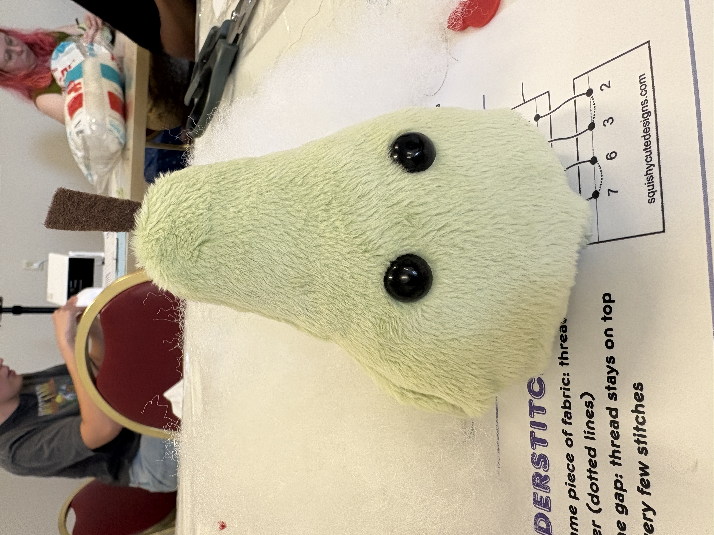

From July 24-August 2 I attended Fidget Camp in SF!

I hosted a workshop titled "3D Scanning from virtual to miniature." In just 1.5 hours, participants made live, interactive websites including objects that they 3D scanned!

I contributed to a stained glass chessboard piece with moving fingers as chess pieces! I cut and grinded stained glass to build the chessboard using copper foil and solder.

I also sewed plushies, made paper lanterns, wrapped coils for brushless motors, made chopsticks, and learned about carbon-fiber layups.

I made lots of new friends throughout exploring the Bay, SF, and Oakland.

<video src="/blog/assets/fidget-camp-workshop-video.mov" controls style="width:100%"></video>

<video src="/blog/assets/fidget-camp-project-video.mov" controls style="width:100%"></video>

