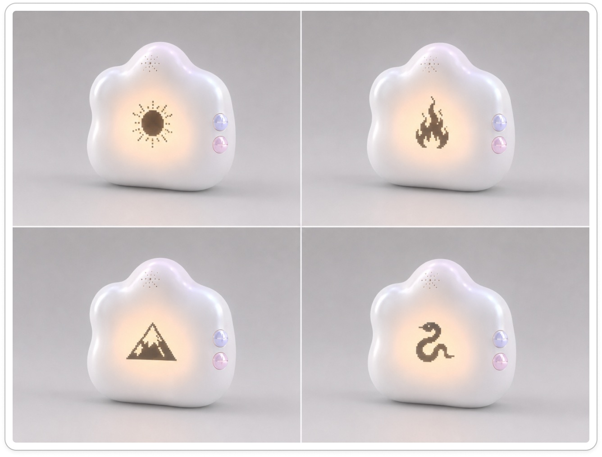
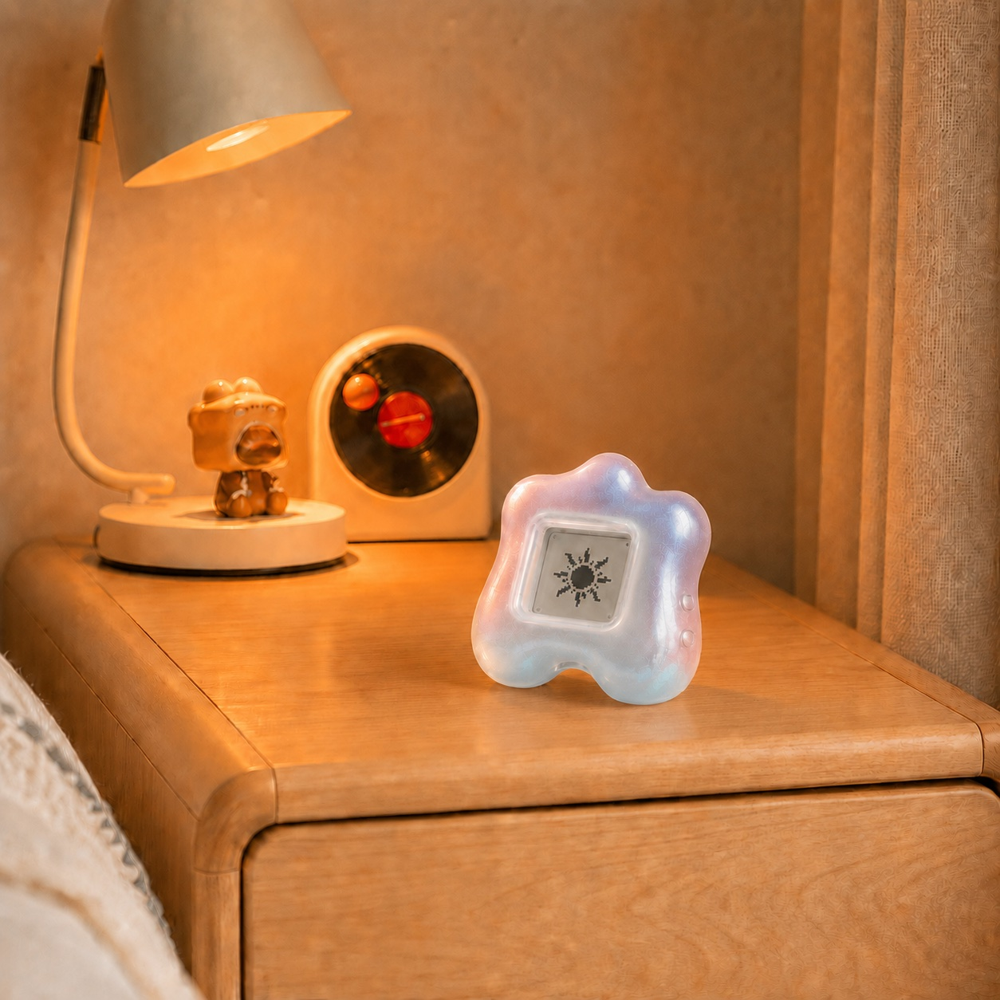
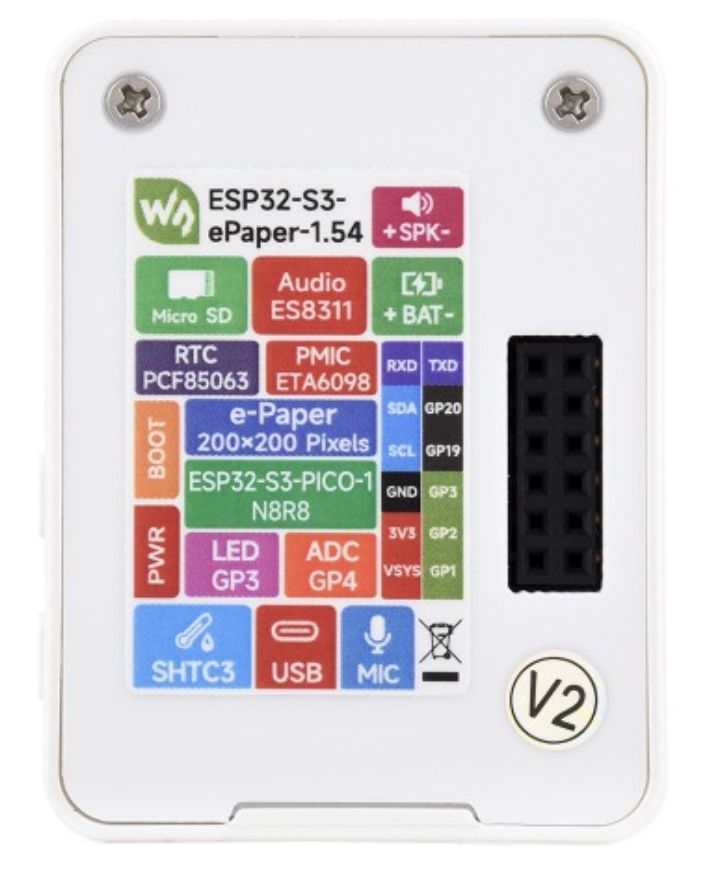
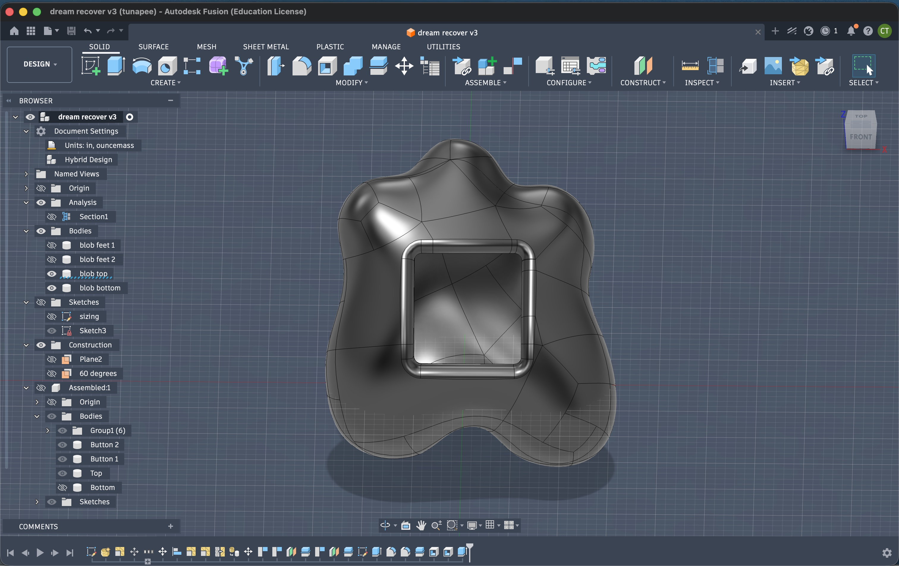
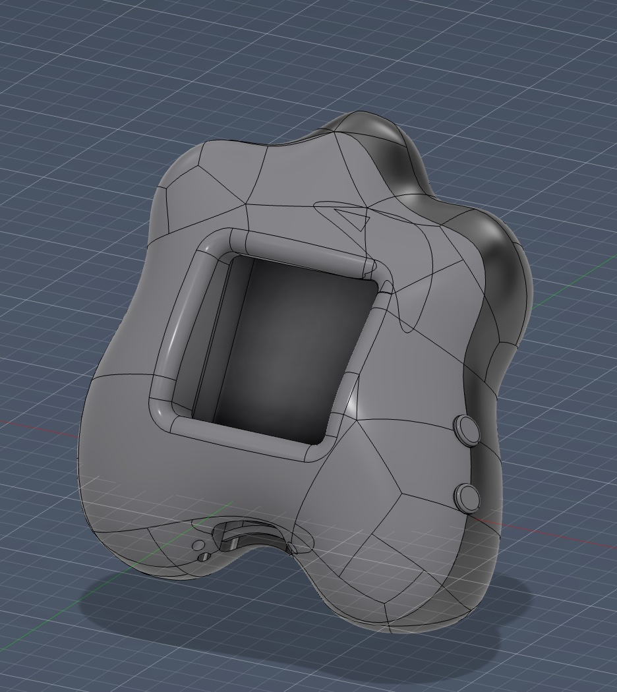
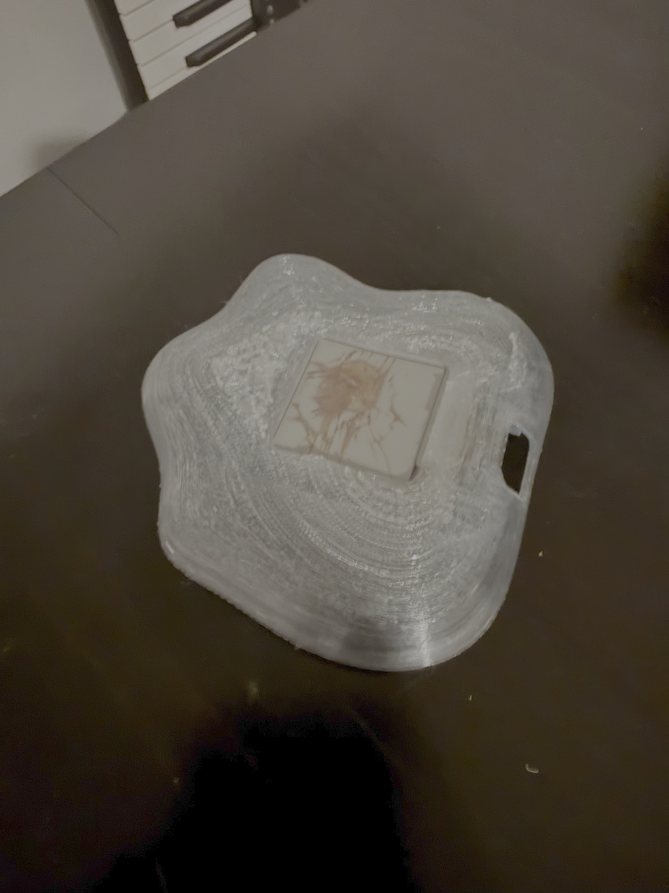
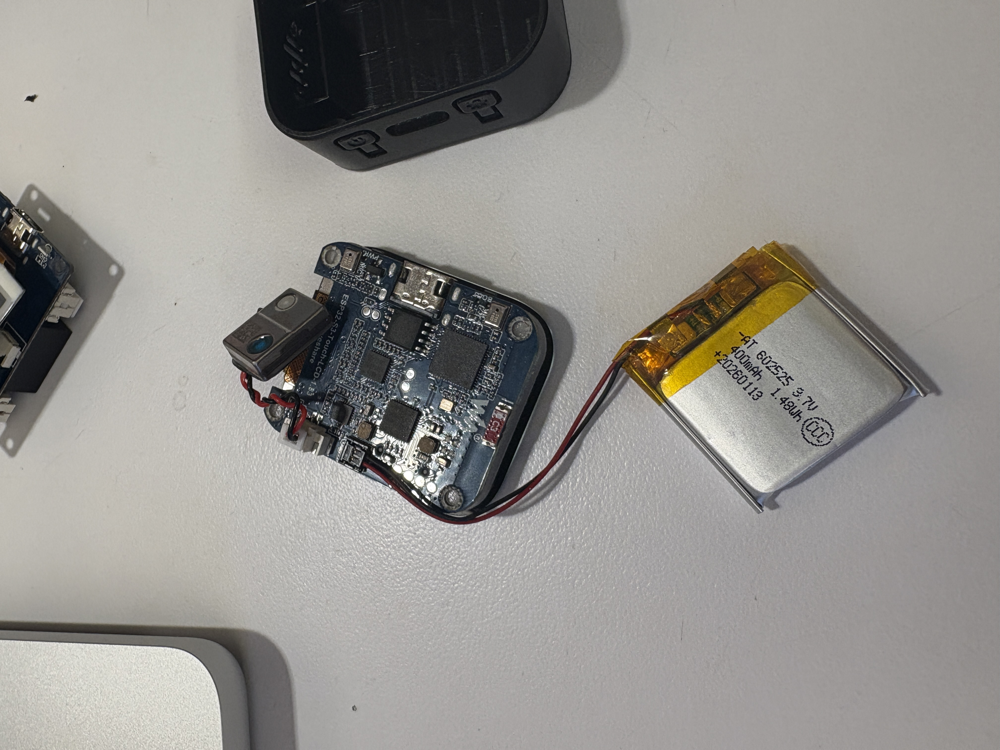
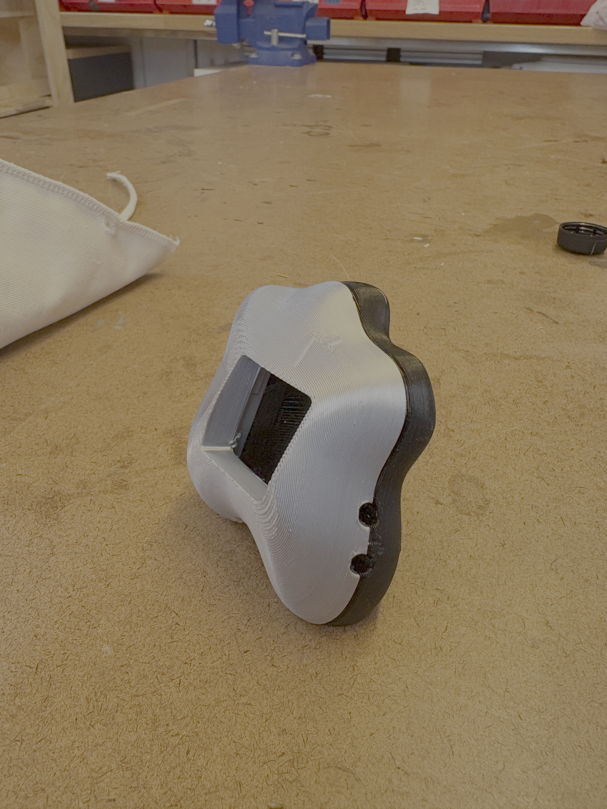
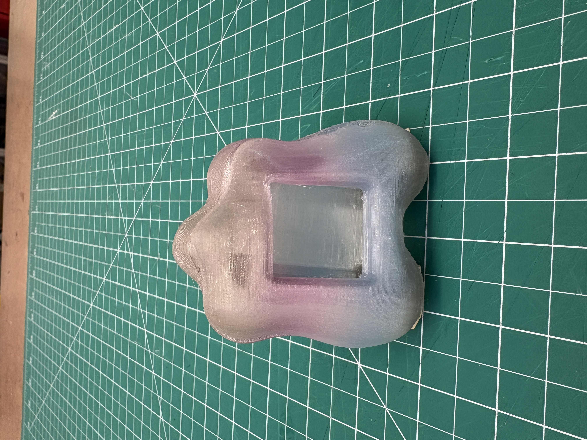
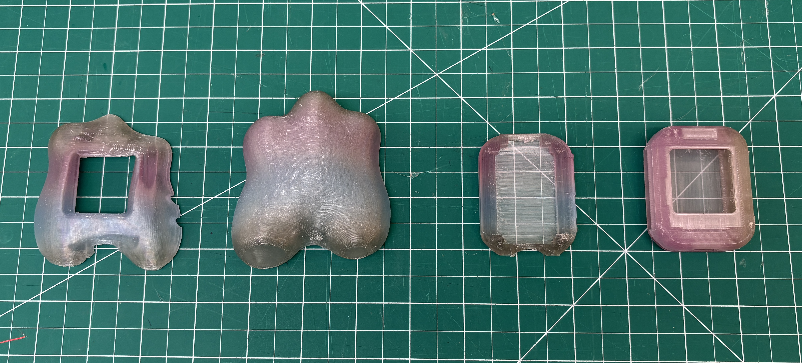

In May, I met my first freelance client almost by accident, at the [NYC x Design Week group exhibition: Utility of Joy](https://nycxdesign.org/events/group-exhibition-utility-of-joy).

I was checking out a project when the person behind it noticed me and struck up a conversation. She got so excited mid-conversation that she accidentally spilled food on me, told me to "stay right there," and dashed to grab napkins, instructing me to chat with her friend in the meantime.

We hit it off immediately, swapping past projects and finding a lot of overlap. It turned out that he had some ideas he wanted to bring to life but needed someone with CAD experience to design the enclosure. He asked if I was interested. I was hesitant, but said yes anyway.

June ended up being so hectic. Juggling three student jobs (ITP Camp counselor, Shop, and TAing) on top of this new project, but I still made time for it.

It started as freelance work but turned into something more like a summer internship with a friend who happens to pay me. He's been a genuinely encouraging mentor throughout: pushing me to set a fair price for my work, working together on conceptual development, and offering perspective on branding and long-term marketing drawing from his own experience at a creative agency. I've learned a lot from the experience and I'm grateful for it.

Serendipitous meetings like these are what's great about New York!

The project itself: we're designing an enclosure for a custom dream recorder built from a modded e-ink display paired with an ESP32 development board.

### Initial conceptual mockups

### The board we're using

The board we're using is the [WaveShare ESP32-S3 1.54inch e-Paper AIoT Development Board](https://www.waveshare.com/esp32-s3-epaper-1.54.htm?srsltid=AfmBOoqFLhGV8LROBypu-jGjSc0k3TggqS9BTPA-Y693KQecjfEGHoyo)

### CAD modeling

### 3D-printed prototypes

