In February, Anshula Saha and I co-organized the 2026 Stupid Hackathon at [**New York University**](https://www.linkedin.com/company/new-york-university/) [**ITP (Interactive Telecommunications Program)**](https://www.linkedin.com/company/itp-nyu/).

[**Sylvain Bureau**](https://www.linkedin.com/in/sylvain-bureau-5a7a07/) and [**Thomas Brigger**](https://www.linkedin.com/in/thomas-brigger/) of [**ESCP**](https://www.linkedin.com/company/escp-business-school/) Business School saw something familiar in it and invited us to the Improbable Education Seminar in Paris.

Over a week, we exchanged ideas with peers from around the world, shared past work, ran a two-day project sprint, and presented the results at [**Bétonsalon — centre for art and research**](https://www.linkedin.com/company/betonsalon-centre-d-art-et-de-recherche-villa-vassilieff/), all in service of reimagining education in a world with AI.

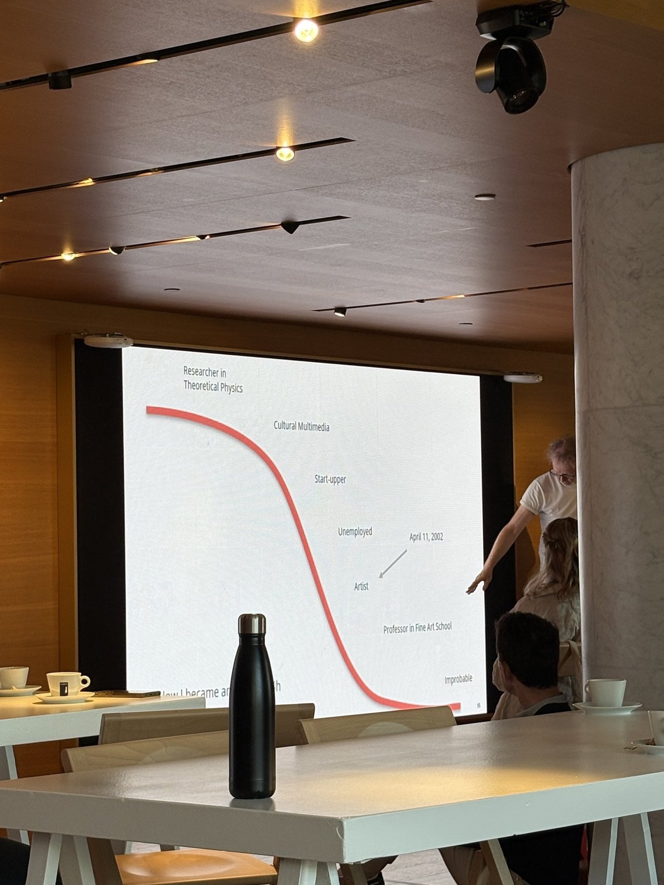

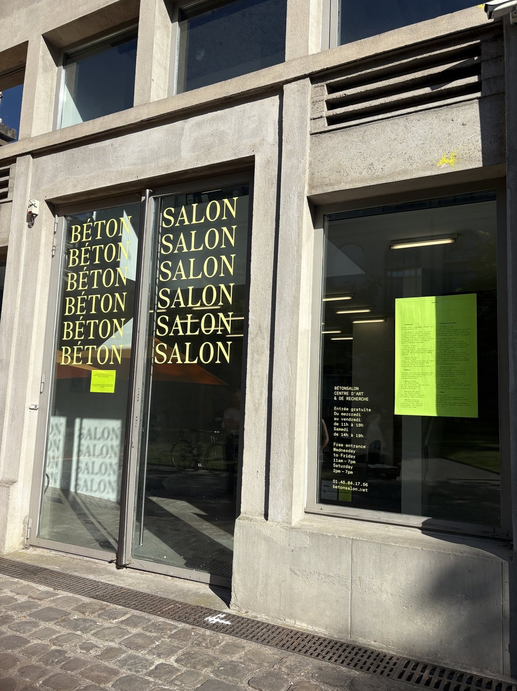

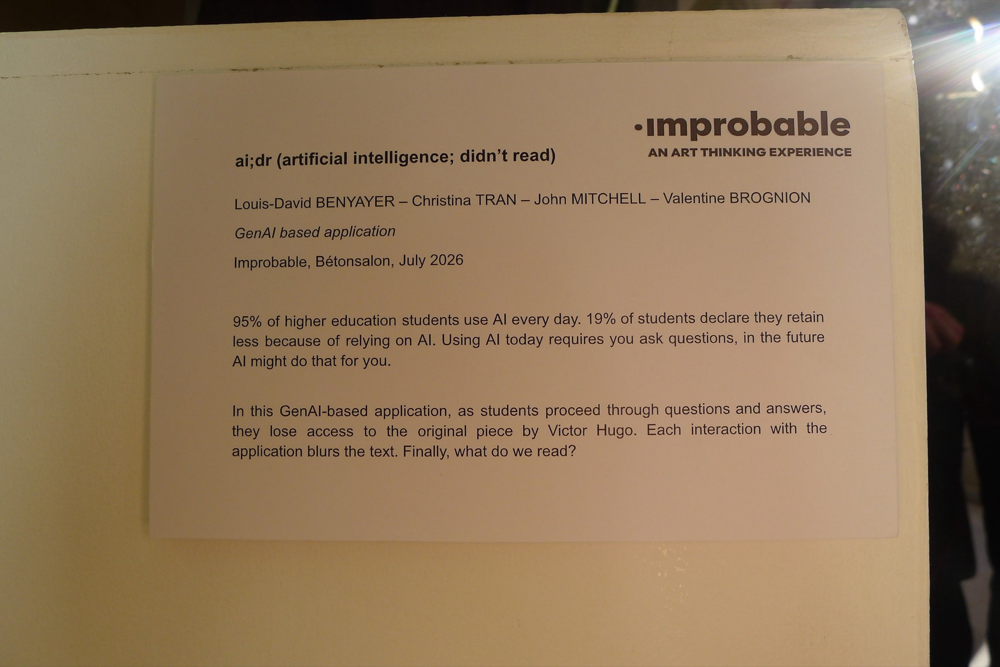

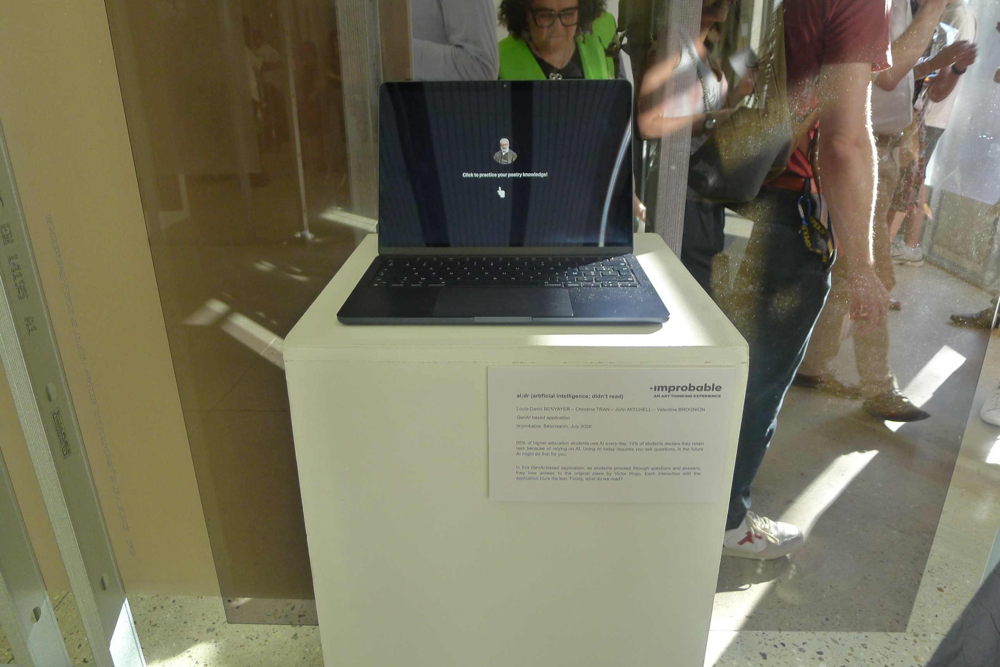

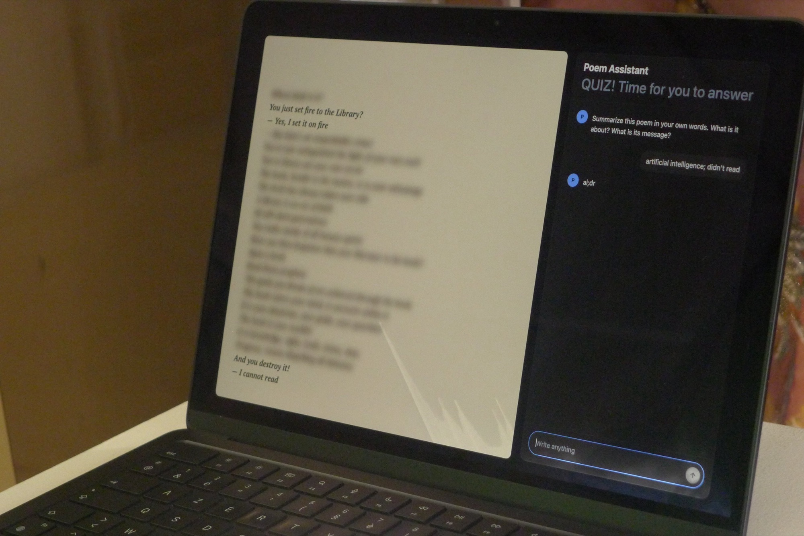

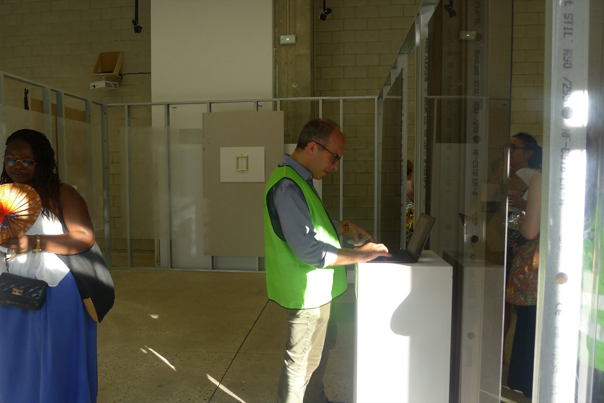

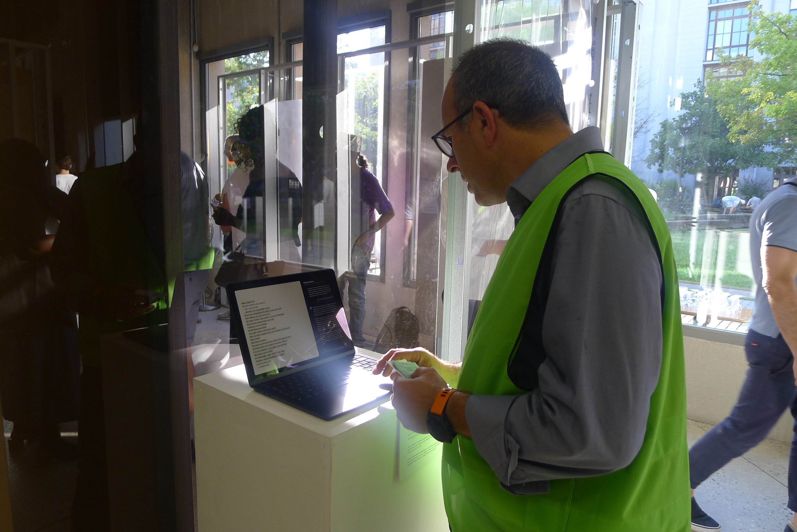

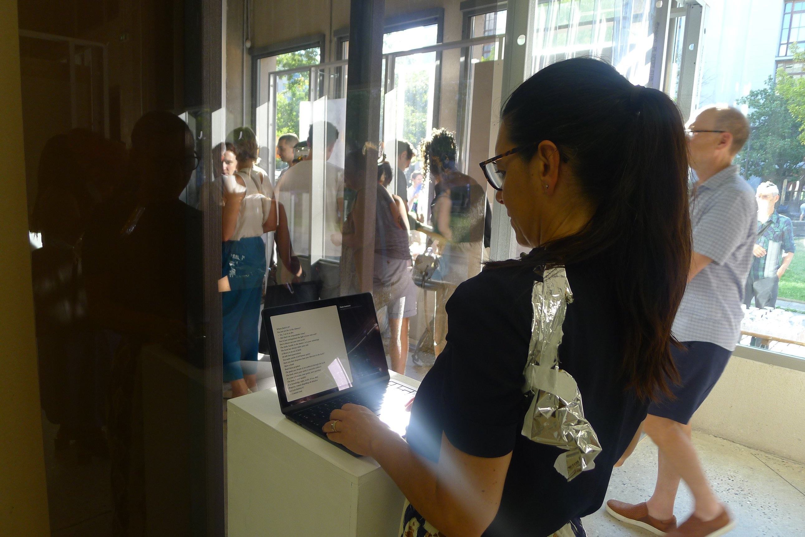

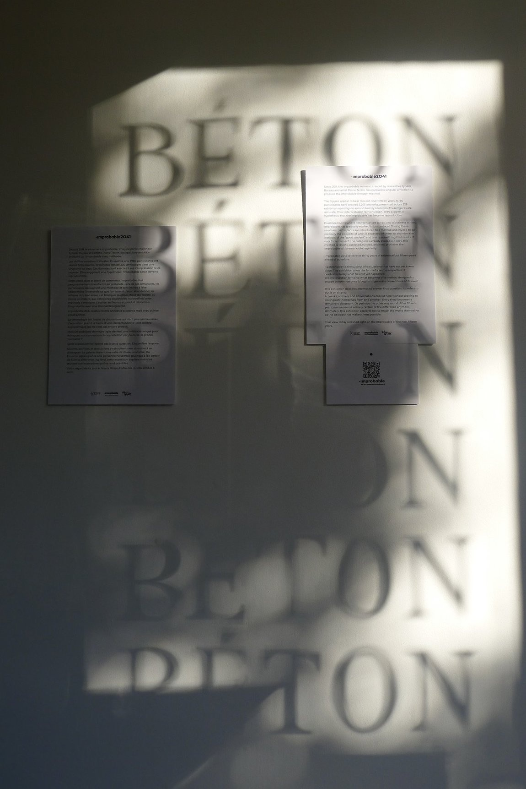

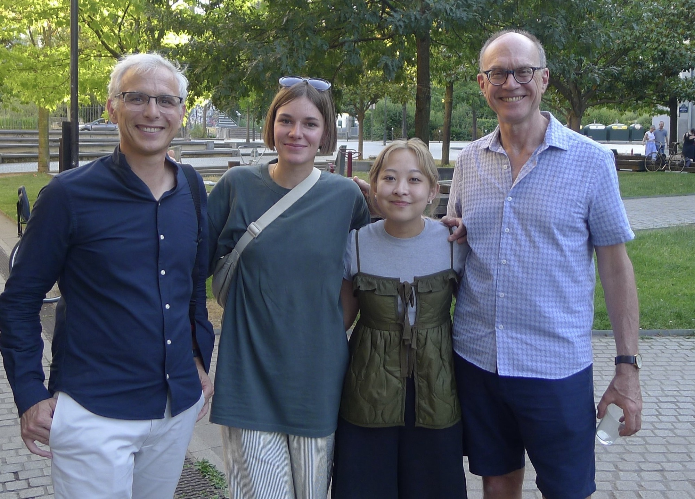

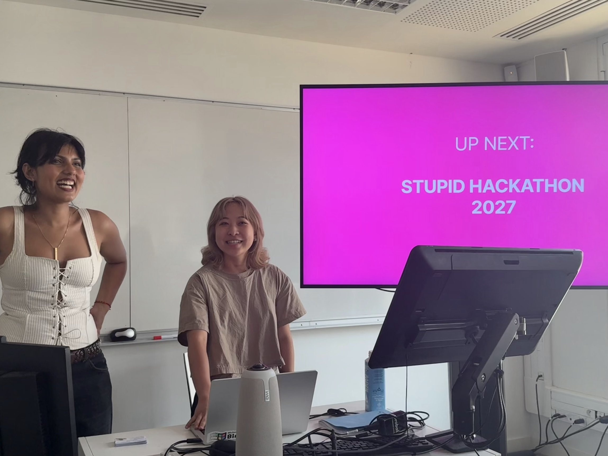

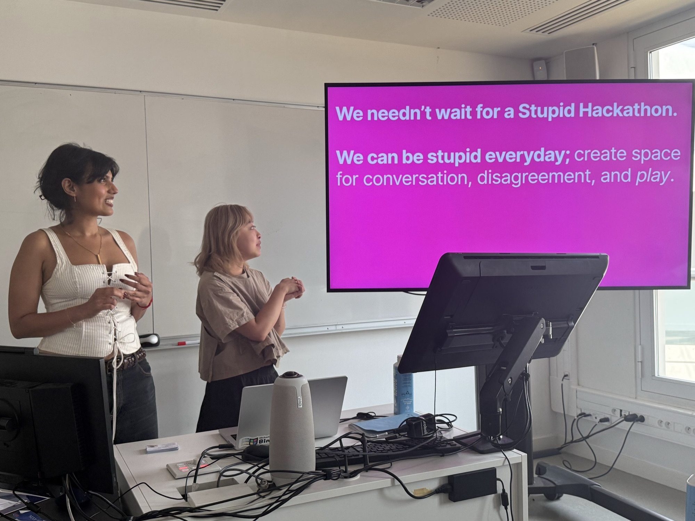

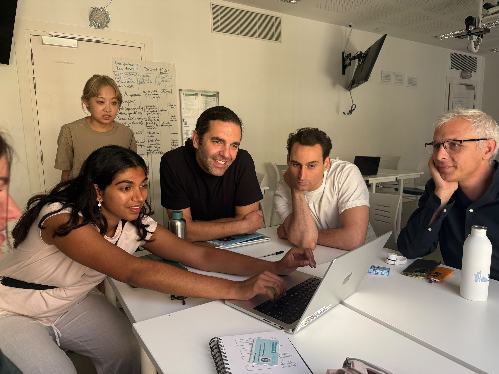

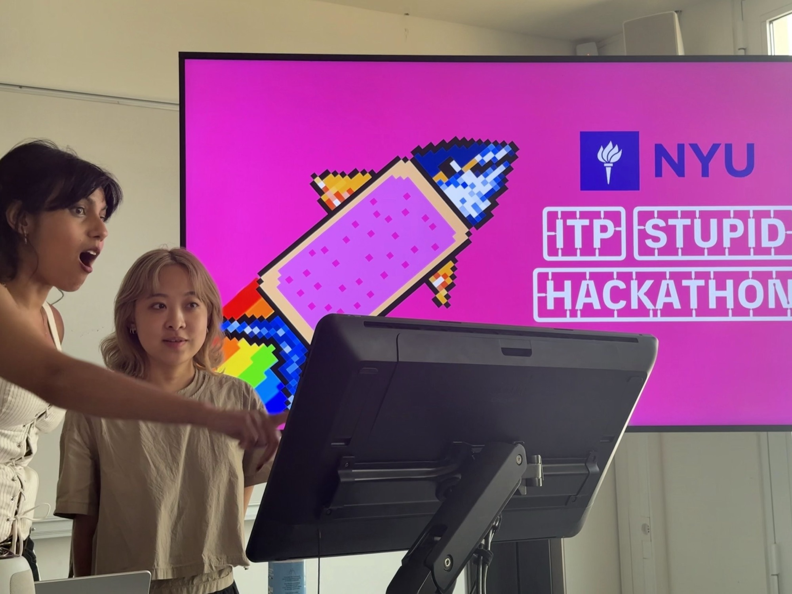
