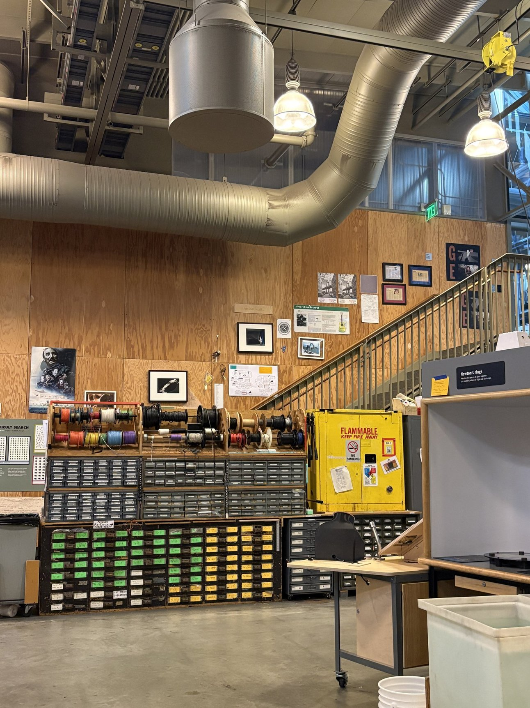
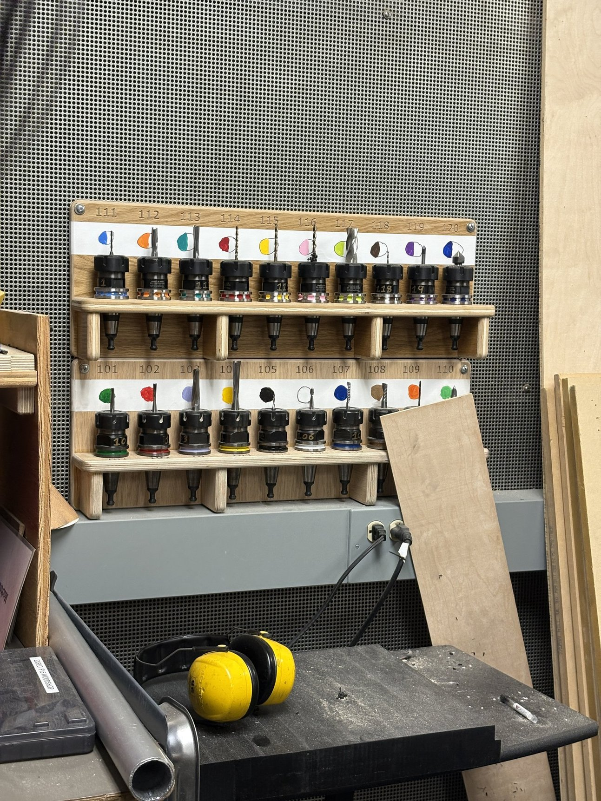
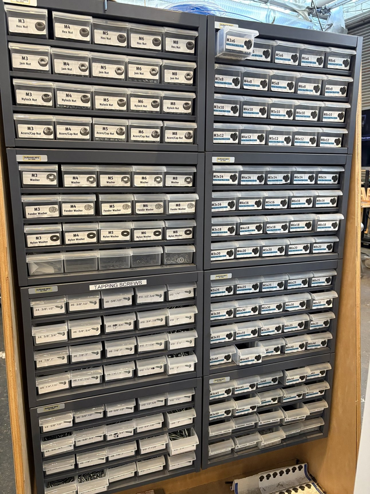
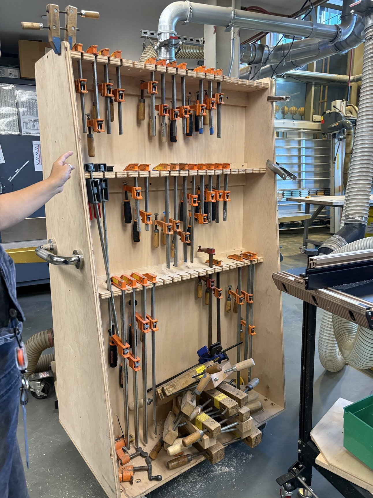
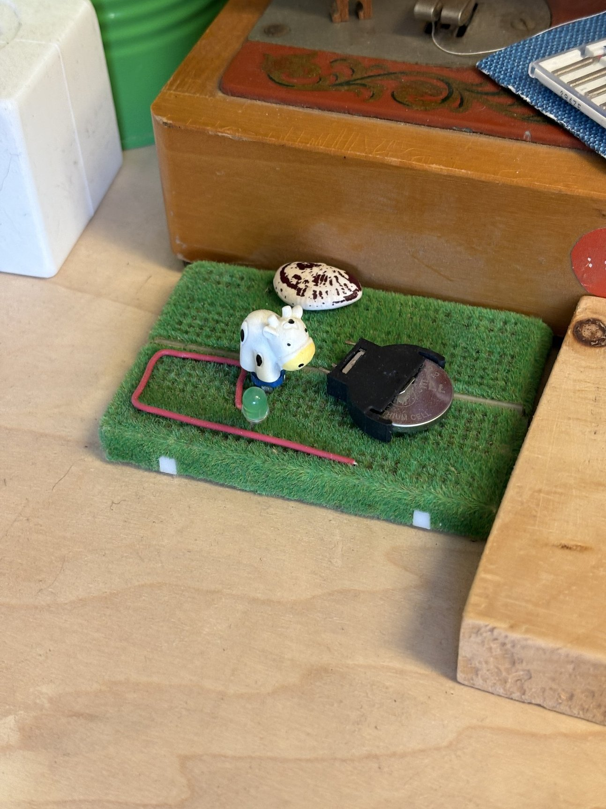

Leia, a new friend from Fidget Camp and ITP alum, is a new media exhibit developer at the Exploratorium in SF. They graciously gave us a tour of the makerspace, which I found to be impeccably organized. I'm in awe, and so glad I went, so that I could open my eyes to what peak makerspace organization looks like. This'll serve as a good example for when I find myself managing my own spaces, starting with my current job at the ITP Shop.

Not pictured, but even their "junk shelf" is organized alphabetically.

&nbsp;

&nbsp;

A familiar sight:

&nbsp;

