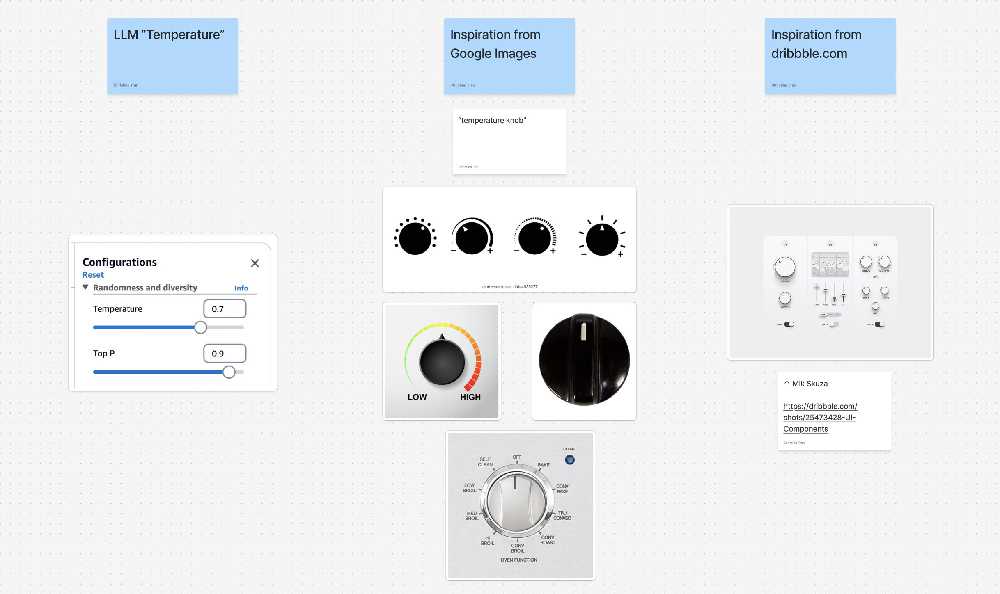

I have one personal website where I host my personal blog, my "professional"/ITP blog, and informal portfolio.

On my personal blog especially, I tend to be pretty raw and unfiltered.

So I asked myself, how do I filter my blog for different audiences? There's a version for an employer or coworker, the version for a friend, and the version for the close friend privy to my deepest, darkest secrets. Three "tiers" of information:
- Employable
- Personal
- Shit-talking

I'd like to think that it's self-explanatory.

I drew inspiration from LLM temperature, a concept I ran into at a past job doing AI engineering. Temperature is a setting you configure separately from an LLM prompt that controls how predictable or "creative" a model's output is. Low temperature keeps things safe and deterministic, where the model always reaches the most likely next word. High temperature is more chaotic, in contrast. Amazon Bedrock's agent-building platform has a UI slider tied to a decimal, dialing the model's behavior up or down, which is what I was inspired by.

So, the temperature dial here dials up and down how filtered my blog is.

One may criticize that if someone was determined enough they'd find a way to get into the more restricted parts of my blog. Honestly, if you're that determined and nosy, you can read into as much as you want. And if you know a better way to secure it, please do let me know.

Here's an MVP I built:

<video autoplay loop muted playsinline style="width:100%">
  <source src="/blog/assets/temperature-dial-1.webm" type="video/webm">
  <source src="/blog/assets/temperature-dial-1.mp4" type="video/mp4">
</video>

<video autoplay loop muted playsinline style="width:100%">
  <source src="/blog/assets/temperature-dial-2.webm" type="video/webm">
  <source src="/blog/assets/temperature-dial-2.mp4" type="video/mp4">
</video>

inspiration board:

## things I want to add
- truly obfuscate text for gated posts, making it impossible to highlight or casually access via dev tools
- a "gate" to unlock higher information tiers: answer questions that confirm closeness to me, e.g. "what are the last four digits of my phone number?"
