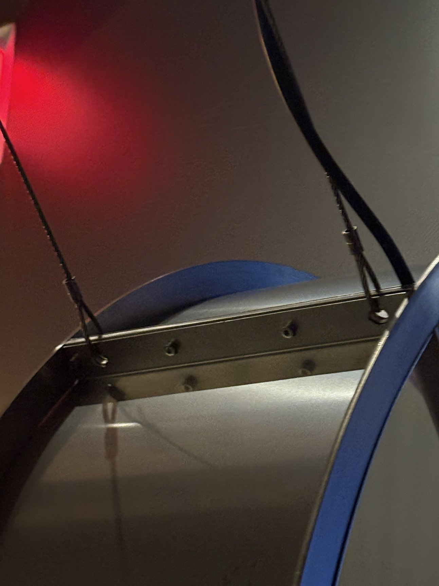
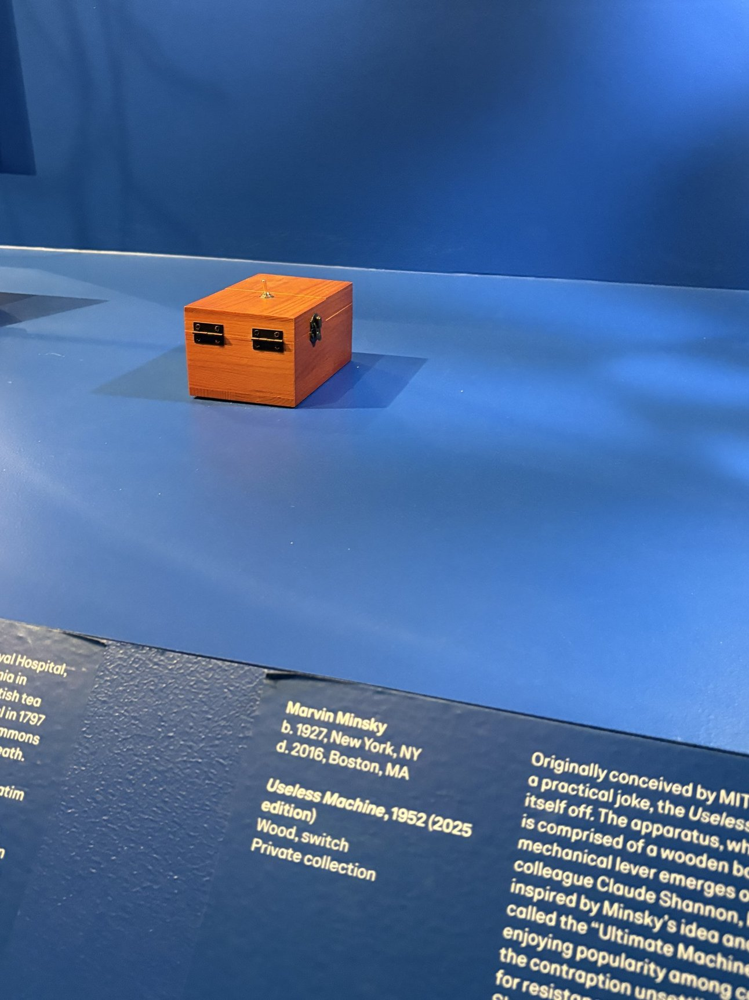
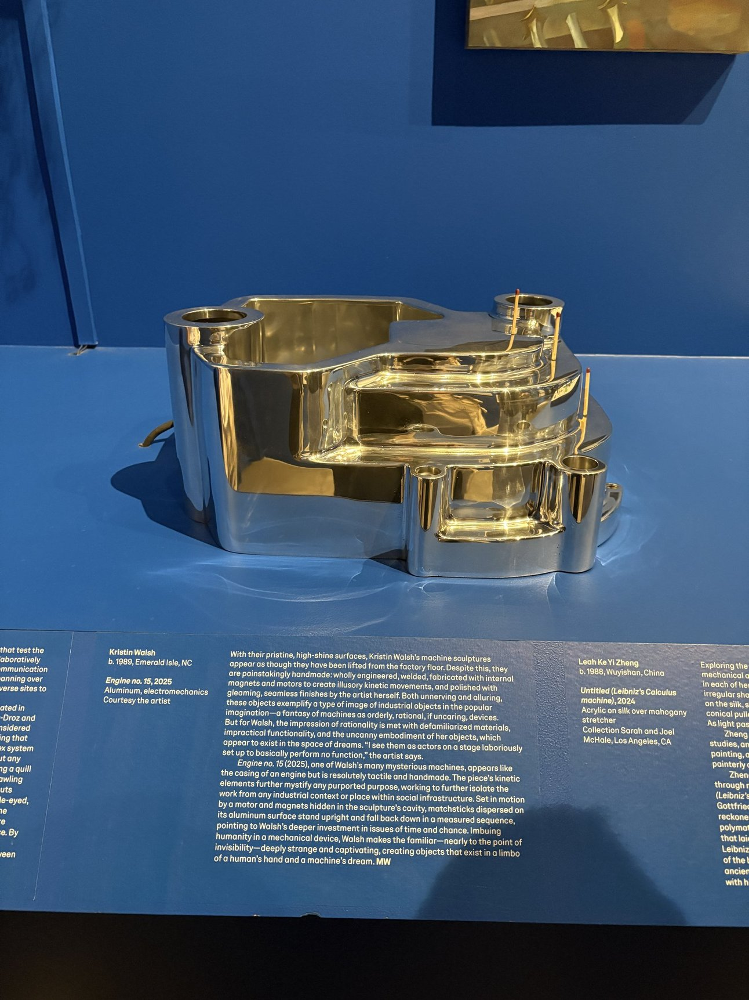
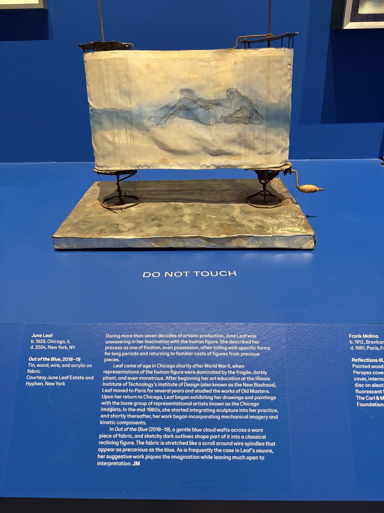
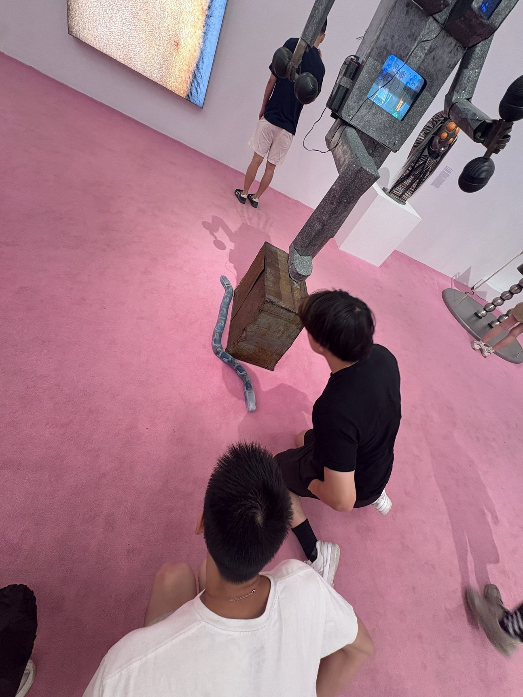
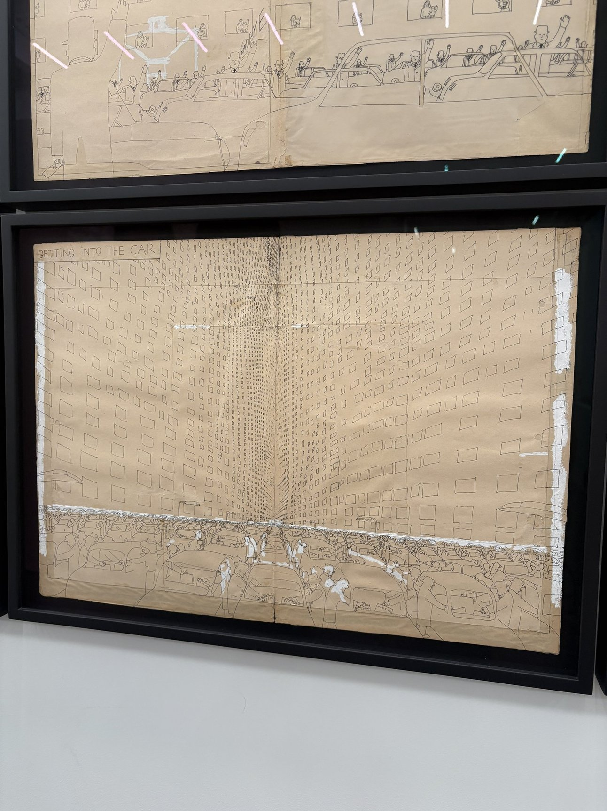
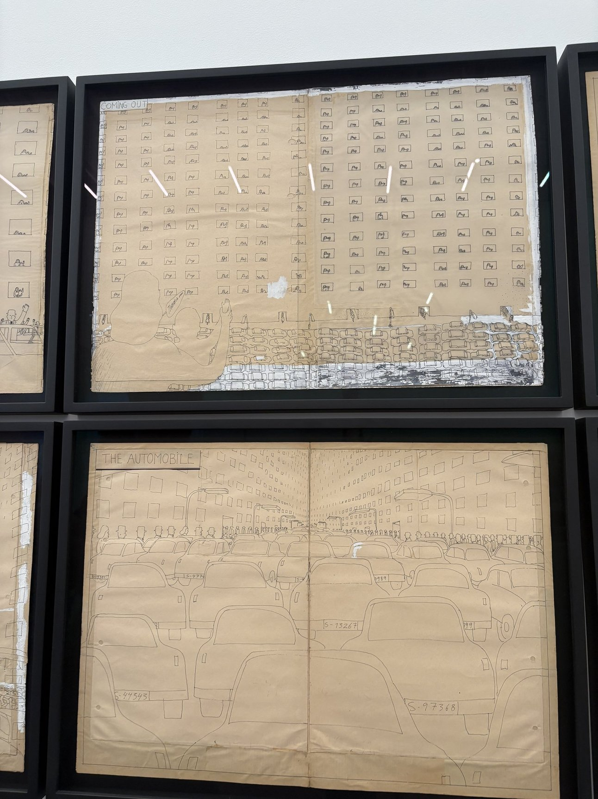
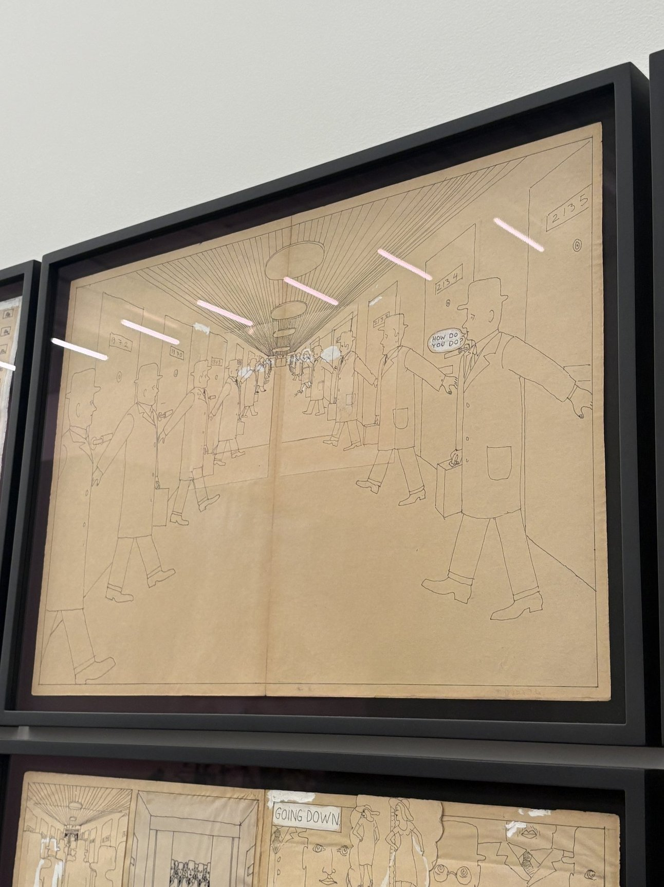
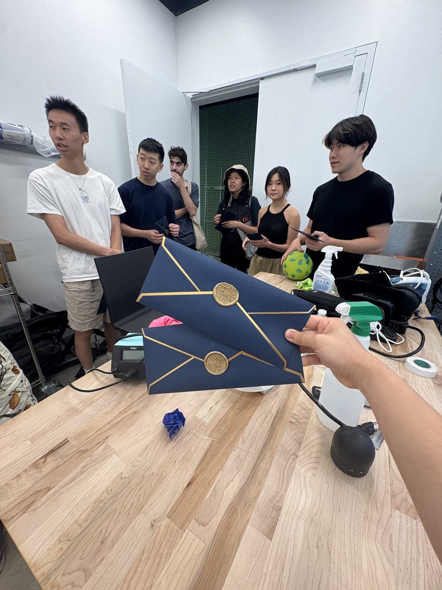
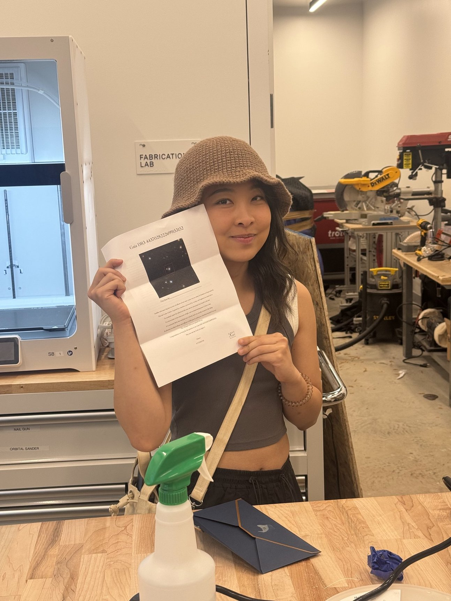

Back in June, I visited the New Museum with my friends Lingwu, Justin, Chianli, Ashley, Bryan and Weylin.

Some things I liked.

I liked how this fan was being suspended from the ceiling.

The infamous "Useless Machine" by Marvin Minsky. Bryan tried to touch it before the security guard had to stop him.

I'm super into metalwork these days.

Is this considered automata? I love the idea of having to manually turn a crank to reveal a story.

I saw this snake move and told my friends about it. It gaslit me, making me look like a liar, because it stayed still for at least 5 minutes before it finally moved in front of my friends. Feat. a Nam June Paik sculpture.

I made Justin and Chianli join me for a 3-person live-reading of this comic. It was so much fun.

Of course, like the basic bitch who visits the New Museum I am, the obligatory Anicka Yi flying piece, which was actually broken.

And then, our friend Morry, who happens to be a New Inc resident, gave us a tour of the office that he works out of upstairs and gave us each a piece of his, First Light! (I later saw the physical installation for this at the Exploratorium in SF so it felt really special.)

