## VisArts Center

At VisArts Center in Rockville, Maryland, I encountered a video art by [Kyle Butler](https://kylewilliambutler.com/). In a looping video, it begins (and ends?) with him sitting on a armchair and screaming into a waterfront, and then cuts to a journey where he drags that armchair from his apartment through the city (presumably NYC) to the waterfront. We laughed because it was absurd, but not because its funny, but because its oddly relatable in its pitifulness...

I relate. For the past 3 days in the suburbs I've been without a car since mine is currently out for repair. I told my brother that I was tweaking from the cabin fever, and so we went to play pickleball and that seemed to fix everything. But it's all a band-aid fix. Like with traveling and adventure, we can use it to temporarily escape our inner turmoil, but unless it's a lifestyle change, the urge to tweak and scream will still be there in that new environment. Honestly, now that I think about it, I don't think the urge to tweak and scream never actually goes away. I think it's just a part of life. And we should just embrace it and give into it rather than trying to suppress it. Let's not be like my exes.

I was also reminded of the time when I was in undergrad, when my friends Andrew, David, and I would sneak into a golf course at night, onto a specific hill, to scream into the darkness. We eventually had to stop because we were stopped by the police for trespassing. I like when seeing new works of art gives me nostalgia.

Diana, my cousin, who came over to watch the video with me after hearing the loud scream, said, "I could see you doing something like this." She's not wrong though, I *am* inspired to do something similar.

It's important that he goes through such an arduous, inconvenient journey to drag around an armchair. He could've easily used a lawn chair. But that inconvenience emphasizes his commitment to this journey, and it makes me feel his screaming even harder.

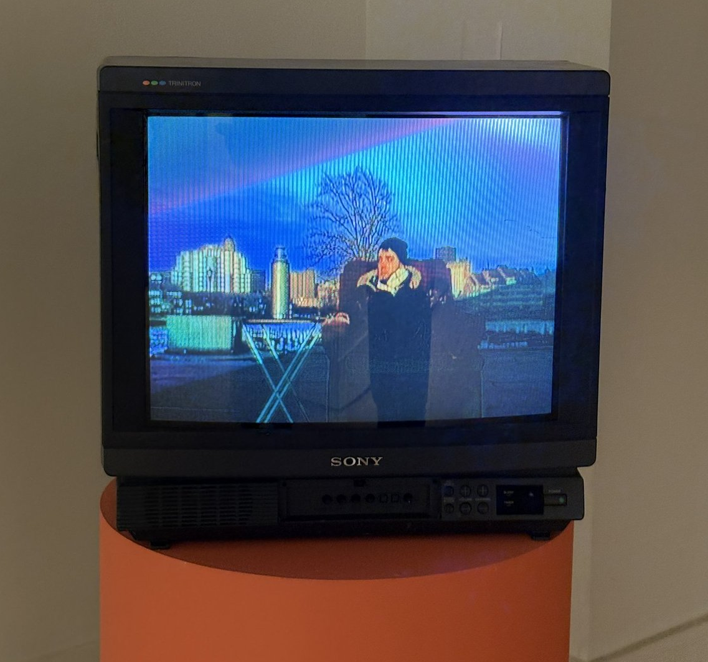

## Glenstone Art Museum

I had no idea that a place like Glenstone existed less than an hour from where I grew up. I just happened to stumble upon it on Google Maps since it was nearby Rockville, where we were eating lunch. I dragged my younger brother over there.

It self-describes as a place for "architecture, art, and nature". It certainly lives up to that description. It was a mythical experience to walk through fields of tall grass and encounter giant sculptures. I felt like a Pokemon trainer. I've never been to Storm King Art Center in Upstate New York, which is also outdoors, but I wonder if it's similar to this. There are indoor galleries that give a similar vibe to Dia Beacon.

At the end of the day, it's another billionaire's vanity project but it's great that they make it free to the public.

All of a sudden while walking ahead of me in the tall grass field, my brother who normally doesn't care for art started sprinting. I looked up and saw this -- "Split-Rocker" by Jeff Koons. It just emerged into my sight like a Pokemon.

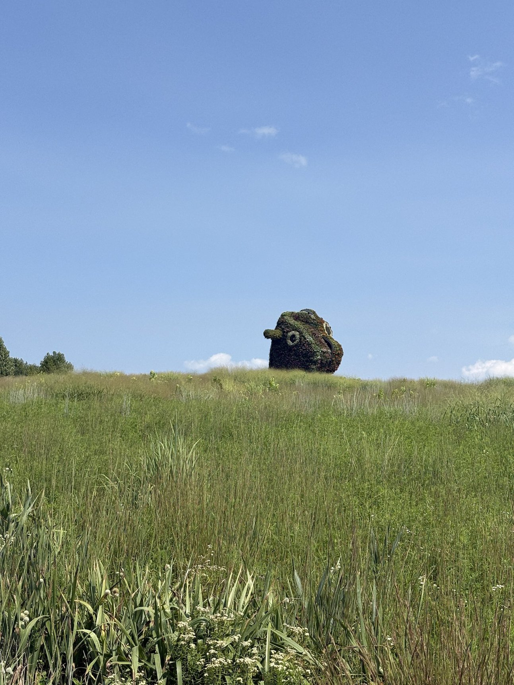

He was so happy to have made it there. We yelled, "LLAMA POWER!!" and stood there for a good while to "absorb the llama power".

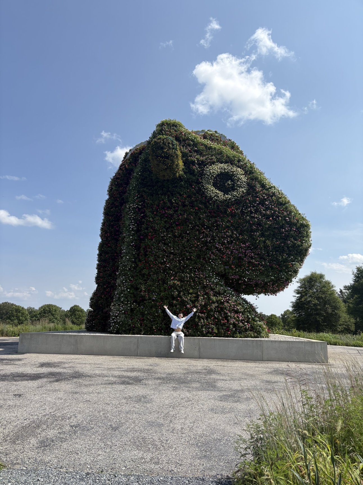

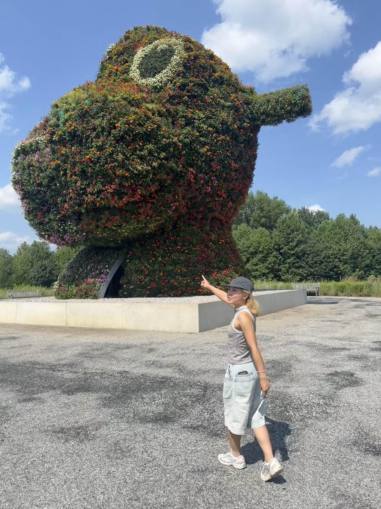

"Sylvester" by Richard Serra. This one has a disorienting effect where as you're walking through it, you can't see an end. You just see more of this seemingly never-ending brown wall that's swallowing you.

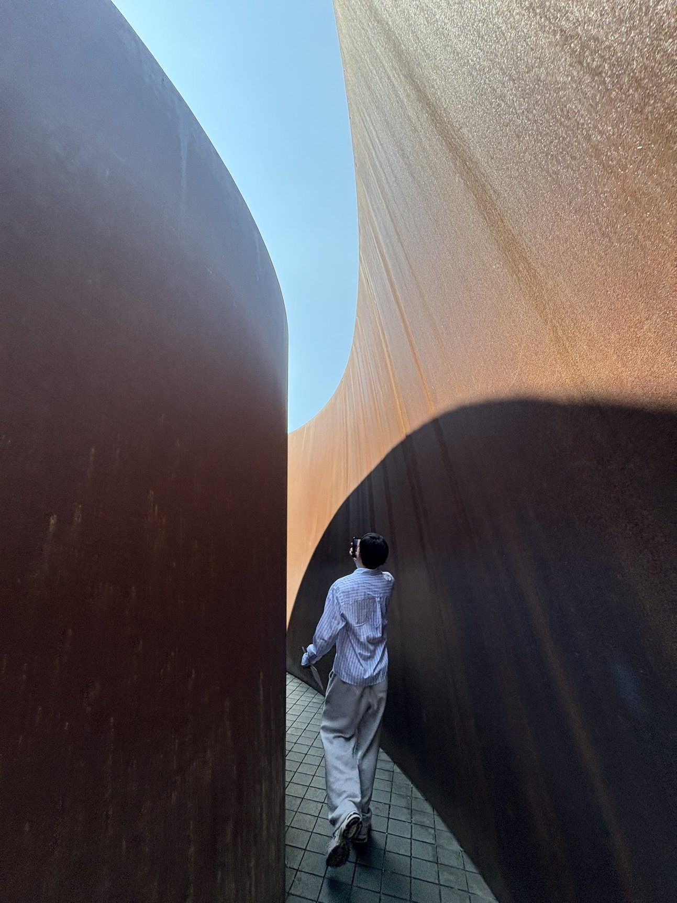

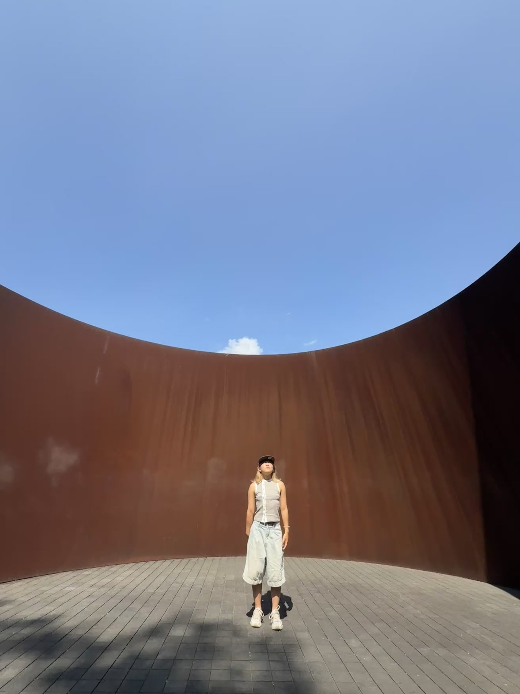

I keep encountering circles that open up to the sky this year. I've been seeing a lot of James Turrell's work.

"Compression Line" by Michael Hezier. This one is interesting because it was originally a site-specific land art sculpture in California's Mojave Desert. It's a single long weathering steel structure buried in the earth. What's causing the bowing at the center is the pressure from the surrounding soil pressing the metal walls inward. I don't think it can be considered "site-specific" anymore because it was dismantled and transplanted from California to here in a rich person's art museum in Maryland. Its no longer the same earth or soil. To me, its not the same artwork... I feel that "site-specific" entails the societal and environmental context surrounding an artwork, in this case location. Glenstone acts like a neutral, white-walled gallery that is actually *not* a neutral backdrop, but a space designed to make the art object look eternal and decontextualized. Artists like Hezier left the gallery altogether to react against this, so I find it ironic that this artwork has made it to a place like Glenstone.

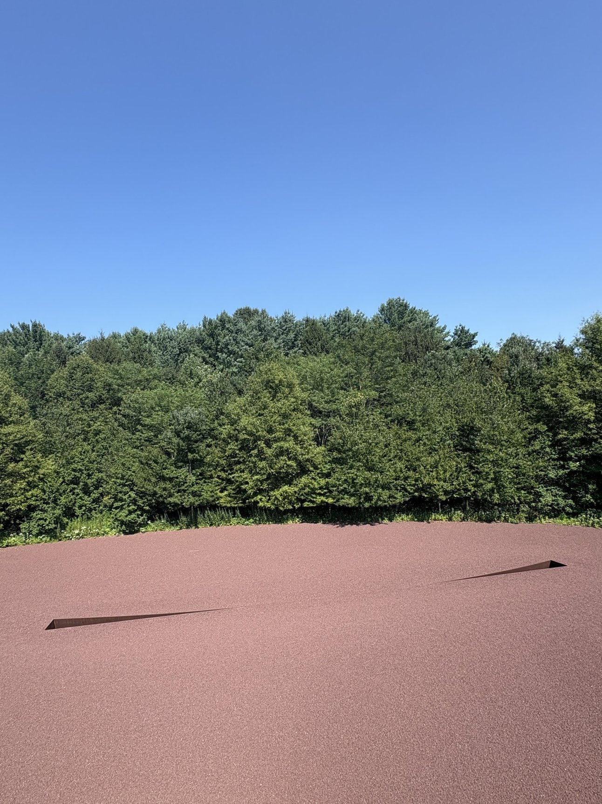

An interesting display of On Kawara's "Moon Landing". The ceiling was soooooooooo high. I drew inspiration from this to make [tunapee.online/doomscroll](https://tunapee.online/doomscroll).

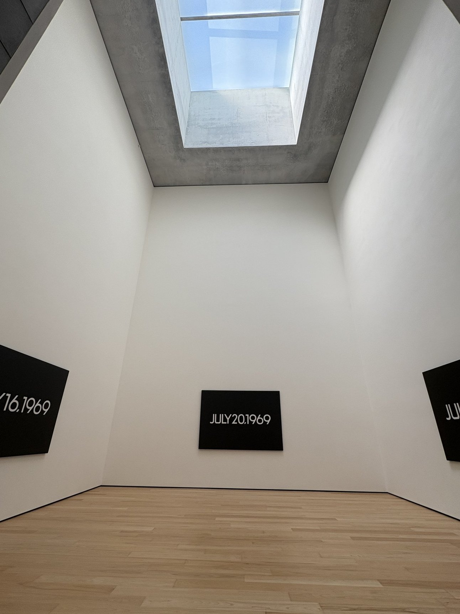

Rubber Pencil Devil (Hell House) by Alex Da Corte. This is an elaborate enclosure for a VIDEO ART PIECE. It turns watching video art into a whole installation experience. Good shit. I usually find neon lights to be so annoyingly jarring but somehow the ones here had a certain softness to them that didn't diminish their vibrancy.

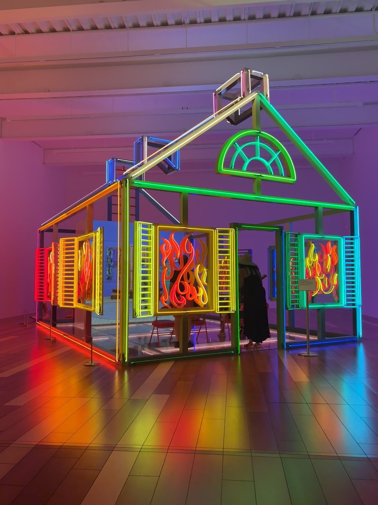

"The Decorated Shed" by Alex Da Corte. I couldn't take a good photo of this one but it's a diorama of a town with tall signs from recognizable American fast food chains. My brother and I agreed that it felt reminiscent of our long road trips driving through towns like this. I think about driving through the part of West Virginia that our family used to refer to as "sad" which is the literal translation of another term for "boring" or "drid" in Vietnamese.

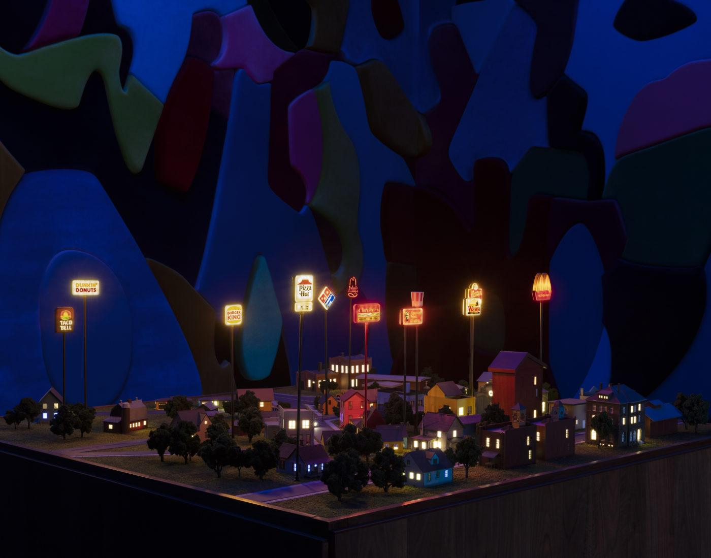

There's lots of nice spaces like this filled with books where visitors can hang out and read quietly. Since it's always free, I could see myself coming here to just read and enjoy the architecture, art, and nature during my visits home.

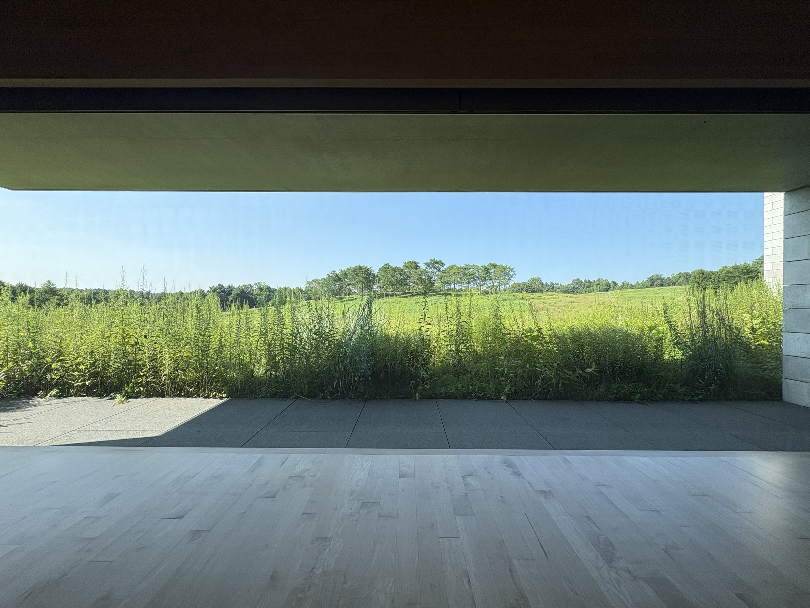

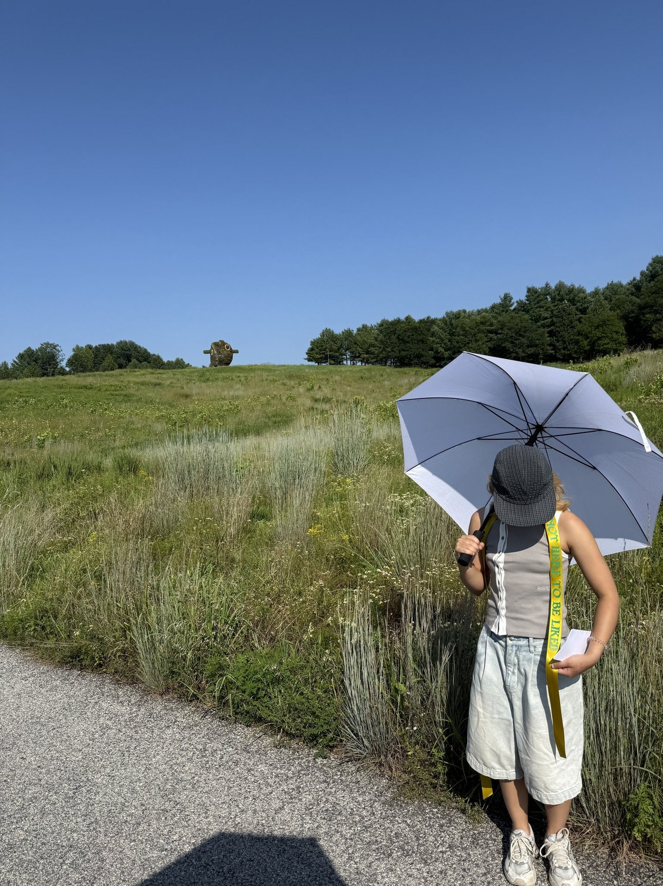
