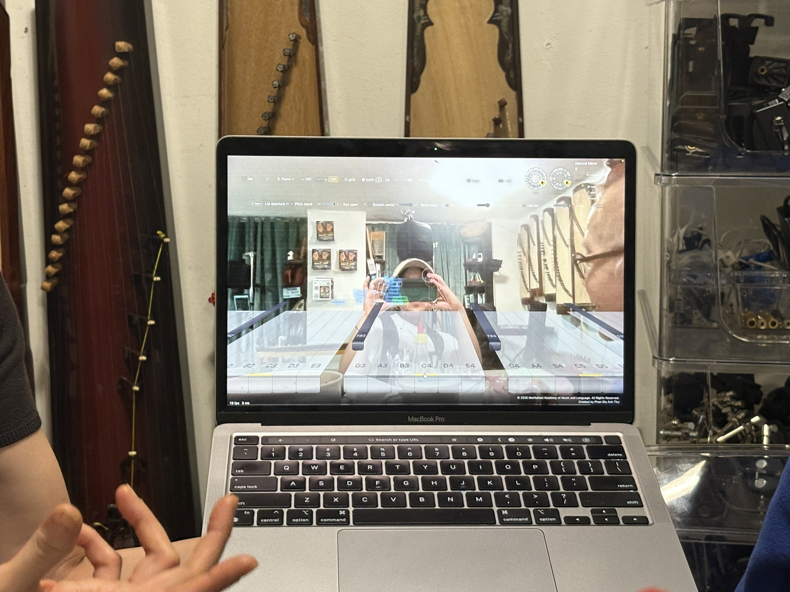
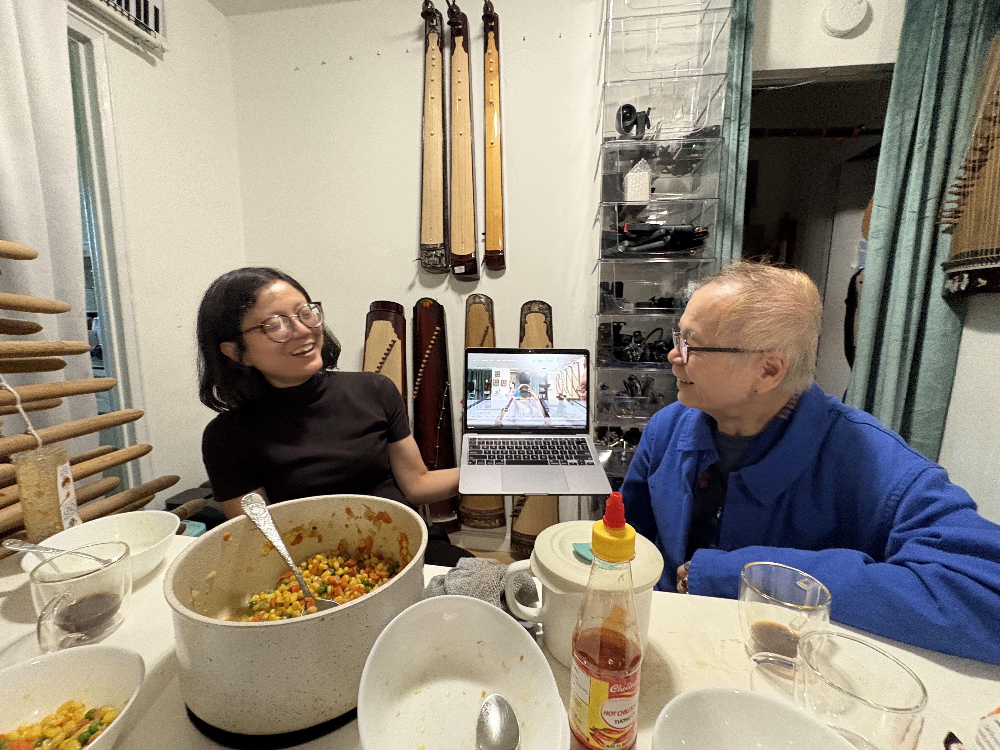

i am learning the đàn bầu, the vietnamese monochord, from anh thu and nhan. i've been spending some time with them after our weekly classes. today we were snacking some stir-fried corn. when i shared with them that i code for a living, anh thu suddenly, excitedly, whipped out her laptop to show off the music apps that the two of them had been learning to vibe-code using tools like mediapipe and three.js. it was so impressive how fast they learned these tools and how much the friction from idea to execution had been lifted for them. 

<video src="/blog/assets/dan-bau-3.mov" controls style="width:100%"></video>

maybe vibe-coding isn't as bad as people make it out to be. as a learning tool, it's powerful. *it was never about the tools in the first place.*

anh thu is a phd in music education from columbia. nhan is a phd in linguistics from nyu. nhan is actually an early researcher in natural language processing, having worked on it in the 80s. he contributed to vietnamese unicode.

being the first in my family to go to college, i didn't grow up having conversations about academia or research. the idea pursuing such a level of education for a vietnamese-american seemed so out of reach. it wasn't until i got older that i began to encounter vietnamese-americans who had such opportunities to study. i'm grateful to have met such passionate, life-long learners as mentors. 