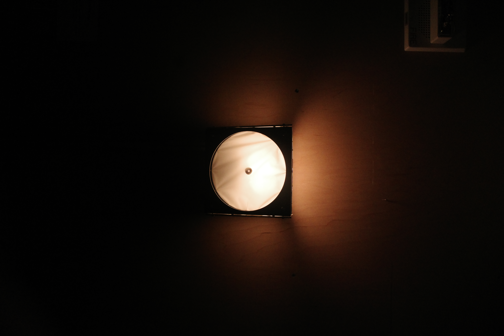
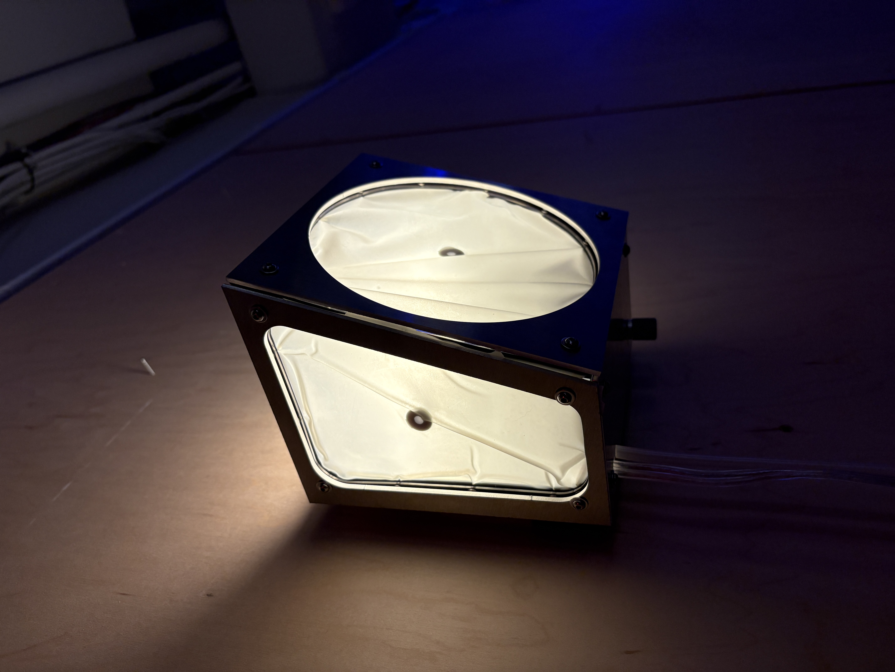
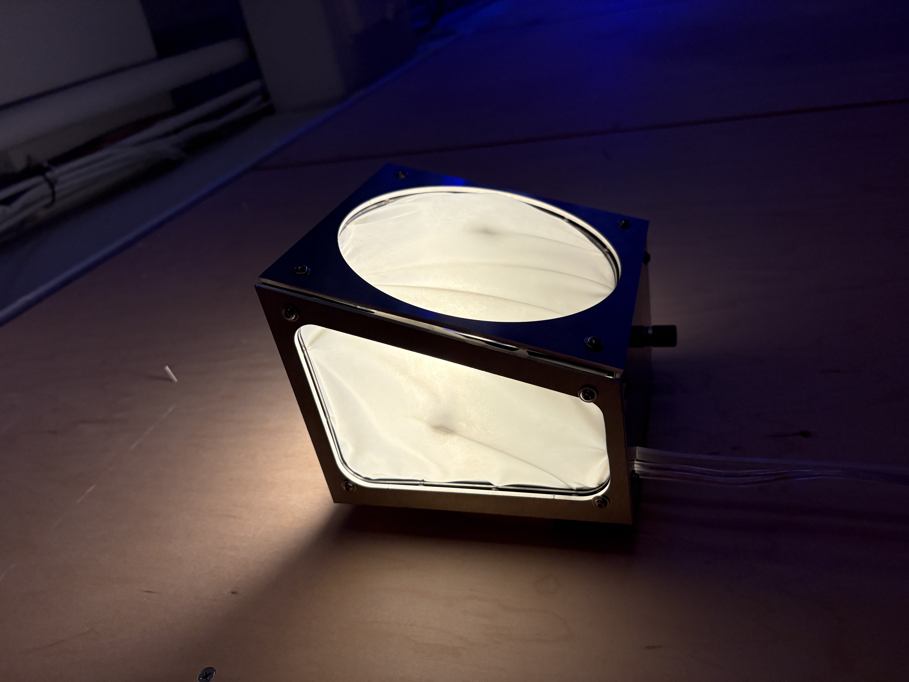
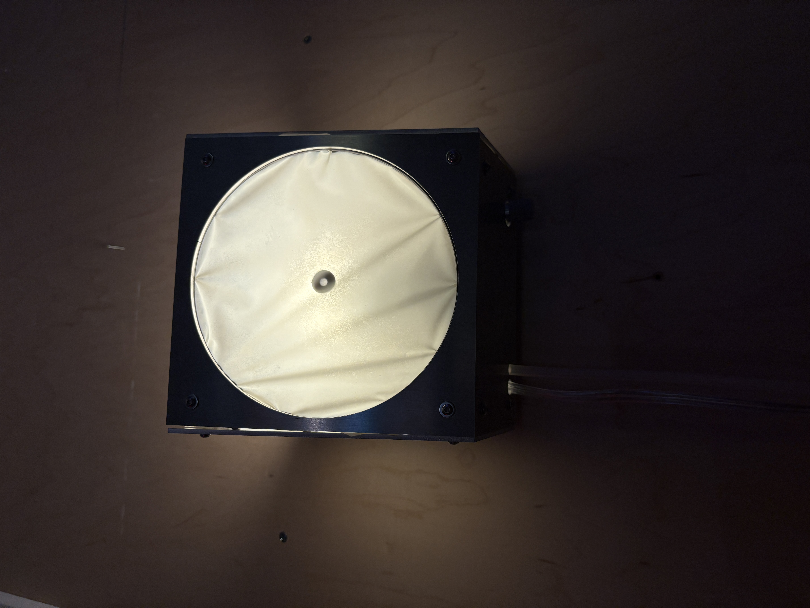
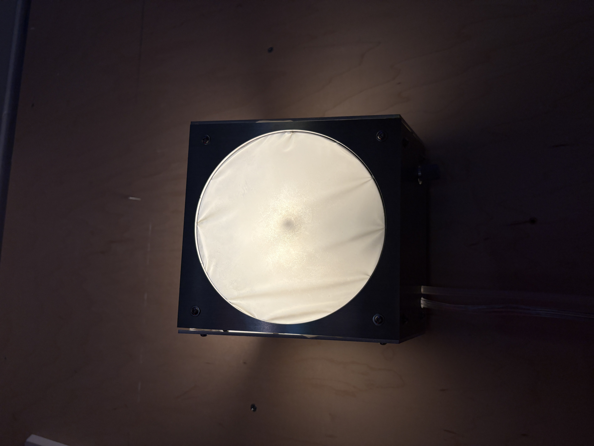
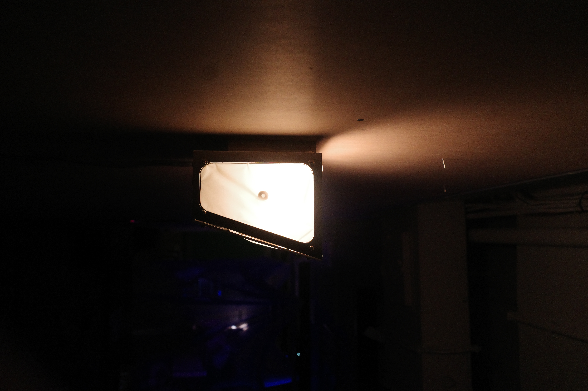
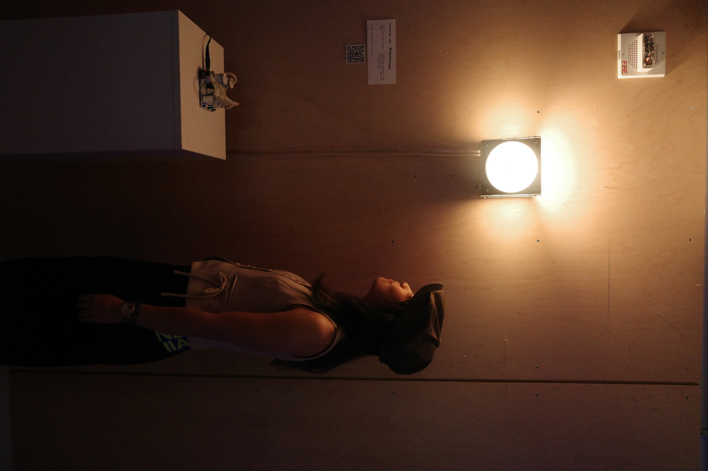

# breathing light

for "Exploring Concepts from Soft Robotics" taught by Kari Love and "Light & Interactivity" taught by Tom Igoe

Inspired by many lamps I saw that *looked like* they were soft and inflatable, but would actually be made out of hard materials like fiberglass, I decided to explore making a lamp that is *actually* soft and inflatable, and breathes.

I was interested in exploring how the light would diffuse as the material stretched and contracted from inflation and deflation.

I used a [Programmable Air kit](https://www.programmableair.com/) designed by NYU ITP alumni Amitabh Shrivastava.

