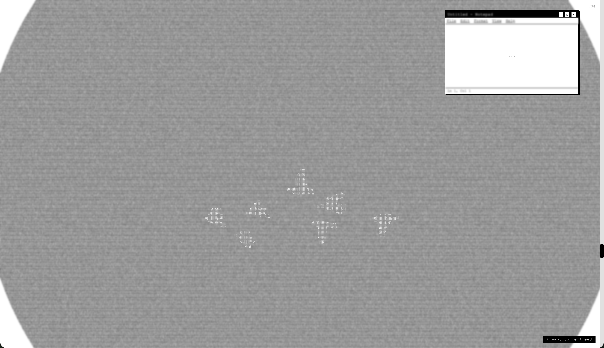

# doomscroll

for "Web Art as Site" 

check it out at [tunapee.online/doomscroll](https://tunapee.online/doomscroll)

a durational web art piece that repurposes the grammar of compulsive scrolling as a form of grief, exploring themes of focused attention and the illusion of agency.

<!-- **love, breakups, longing, healing, growth, clarity, detachment** -->
