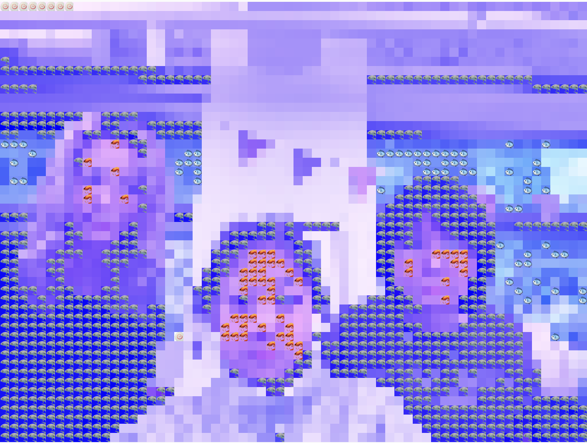
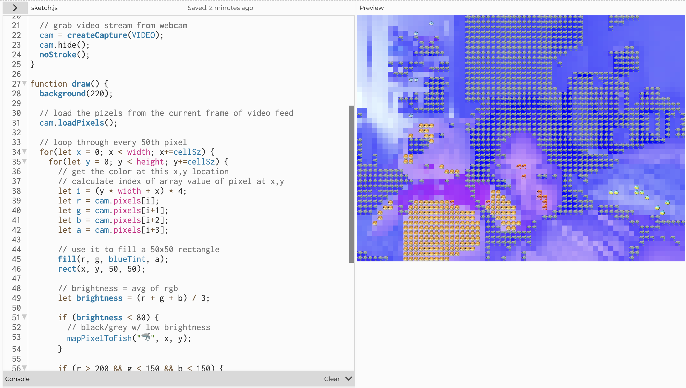

# Fish Cam

A p5.js webcam sketch for Intro to Computational Media (ICM) at NYU ITP. The camera feed is transformed through a slit-scan effect and pixel-mapped to fish emoji — replacing each pixel's color with the closest matching fish.

[open sketch](https://editor.p5js.org/tran.christina918/full/iCMxZABfr)

.png)

