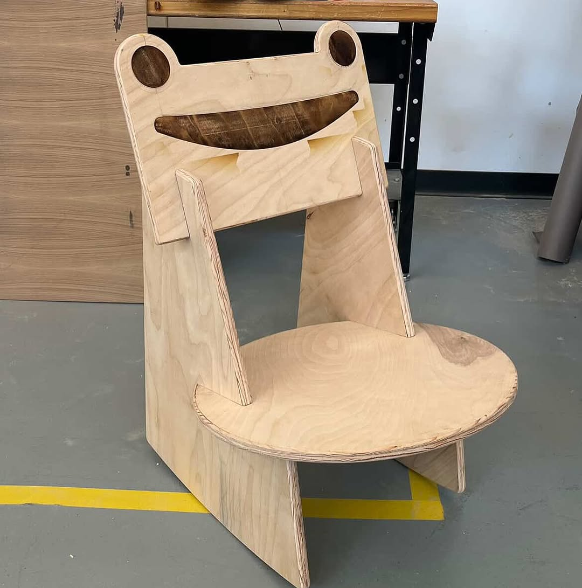

# Froggy Chair: Documentation

**By Christina Tran**

## Inspiration

I drew inspiration from one of my favorite video games, Animal Crossing, where there is an iconic piece of in-game furniture known as the “Froggy Chair”.

The infamous Froggy Chair

Froggy referenced in the wild!

## Sketches

Initially, I wanted to build a 1:1 replica of the original chair, but the woodshop I was in did not have the necessary equipment to curve wood. So, I decided to do what I could with what I had— which led me to a modular rocking chair made with plywood. For the curvature of the chair, I referenced the angles of existing rocking chairs that I saw online and in real-life. There are three main pieces: the back, the seat, and the legs. 

Concept drawing

Technical drawing with measurements 

## Prototypes

I underwent an iterative process of drawing-prototype-drawing-prototype. I mainly used cardboard and masking tape. This helped me to figure out the angles, proportions, and joinery I would use in my chair. I decided to go with bridle joints with the goal of the pieces linking together to hold the chair up without needing glue or other additional hardware.

## CAD

I expanded my Fusion 360 skills by learning from my peers and following a YouTube tutorial series to create a 3D model of my chair. Through this process, I discovered the power of parametric modeling—a feature that lets you build flexible designs where adjusting one measurement automatically updates all related parts throughout the model. This interconnected approach meant that if I changed the seat width, for example, the leg spacing and backrest dimensions would adjust accordingly, maintaining the chair's proportions and structural integrity.

## Woodworking

This was my first time working on a woodworking project this large, so I learned that a large part of woodworking is procuring materials. I ordered a standard-sized (4’ x 8’) sheet of B3 Birch plywood.

I exported my CAD model as DXF files to cut the pieces on a CNC mill. Since CNC bits are round rather than square, the inside corners of my joint cutouts came out slightly rounded instead of perfectly sharp. This actually worked in my favor—my design tolerances had made the cutouts larger than intended, and the rounded corners from the CNC bit helped compensate for this by creating a better fit between the pieces.

I used a router table with a roundover bit to turn the sharp plywood edges into smooth, curved profiles.

I used an orbital sander to make my pieces smooth. 

## Detour

I wanted to create an indented frog face design in the wood, so I used Fusion 360 to design templates for the eyes and mouth cutouts. My original plan was to laser cut these templates from MDF, then use them as guides with a hand router to carve the shapes into the plywood. However, this approach hit a snag—the MDF wasn't the right thickness to work with my router, even when fully extended. I also accidentally burned some of the MDF during laser cutting, which taught me that MDF and laser cutters don't mix well due to the material's flammability. In the end, I skipped the template step entirely and laser cut the design directly into the plywood, which turned out to be much simpler and more effective.

## Outcome

Me sitting on my chair and bringing it home!!! Next, I’m going to prime and paint the chair.

