# “Pick Me” Final Blog

Class: Physical Computing


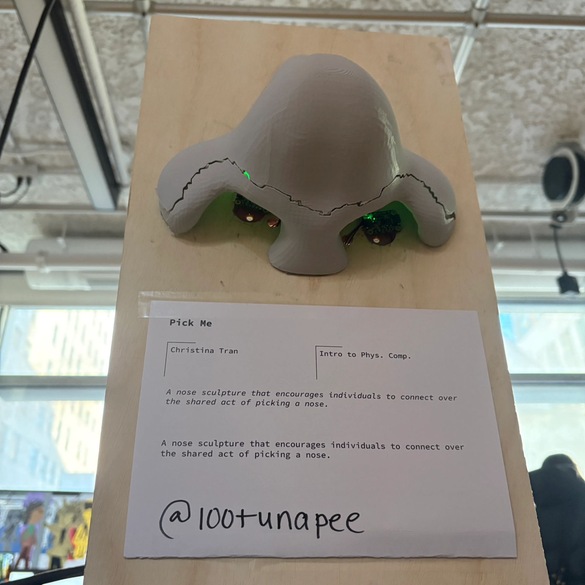


# Video

[E3ED0AA7-9EE0-4D55-93E8-ED53FDFA1AA5 4.mov](assets/E3ED0AA7-9EE0-4D55-93E8-ED53FDFA1AA5_4.mp4)

[48181bc5282141f8993db23c8c76c64d 2.MOV](assets/48181bc5282141f8993db23c8c76c64d_2.mp4)

# Concept/Inspiration

My favorite childhood video game is “WarioWare: Smooth Moves”. It’s filled with absurdist humor, such as its fixation on noses seen in the character design and recurring theme in minigames. 


[https://youtu.be/DWvf2uqJgYI?si=CiG-vG34v8KZ491T](https://youtu.be/DWvf2uqJgYI?si=CiG-vG34v8KZ491T)

Inspired by this, I made a comedic p5.js sketch of a nose dispensing boogers. I shared it with friends and classmates, which got lots of laughs and questions asking ‘why?’. Growing up, WarioWare was how my family connected through play and humor. This led me to my thesis: ‘Everyone picks their nose, but few admit it.’ I wanted to bring the somewhat private experience of nose-picking into a shared space. Maybe welcoming the discomfort through absurdist humor would let us laugh it off and realize vulnerability isn’t so scary. Or maybe it’s just weird and I’m reading too much into it.

[https://editor.p5js.org/ct3450/full/wMdRGIfDB](https://editor.p5js.org/ct3450/full/wMdRGIfDB)

[nose clicker demo.mov](assets/nose_clicker_demo.mp4)

And so, for my Intro to Physical Computing final, I decided to build a nose that dispenses boogers in the real world.

# Electronics

### Materials

- Arduino Uno
- Adafruit VL6180X Time of Flight Distance Ranging Sensor
- NEMA 17 Stepper Motor
- Pololu A4988 Stepper Motor Driver Carrier
- Adafruit TCA9548A I2C Multiplexer
- IC LM7805CT 5V 1A Positive Voltage Regulator
- 100μF Capacitor
- 12V 3A power supply


Early diagram showing internal components

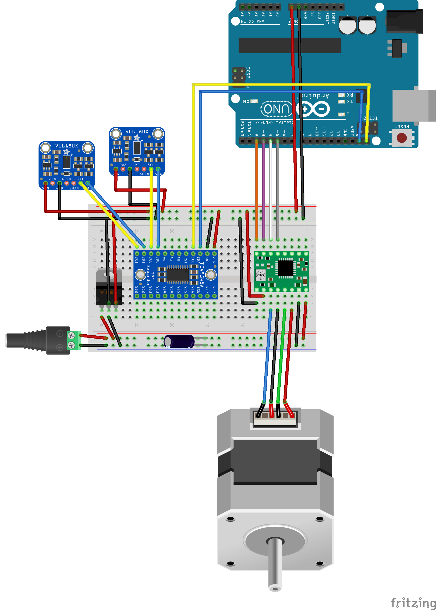

Fritzing diagram of breadboard circuit


Started with breadboard, distance sensor, and Arduino to test sensor range 


Gradually added stepper motor control


Added the I2C multiplexer to allow for multiple distance sensors connected to the Arduino

# Fabrication


Modeled a custom gear in Fusion 360 to fit onto the stepper motor for the ball-dispensing mechanism that I later 3d printed

[IMG_0201 2.MOV](assets/IMG_0201_2.mp4)

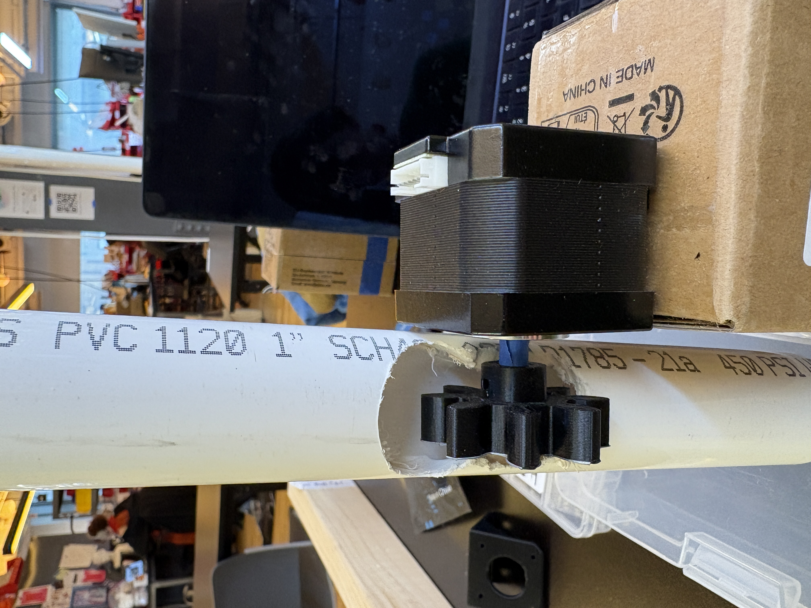

Gear prototype 1 attached to a PVC pipe

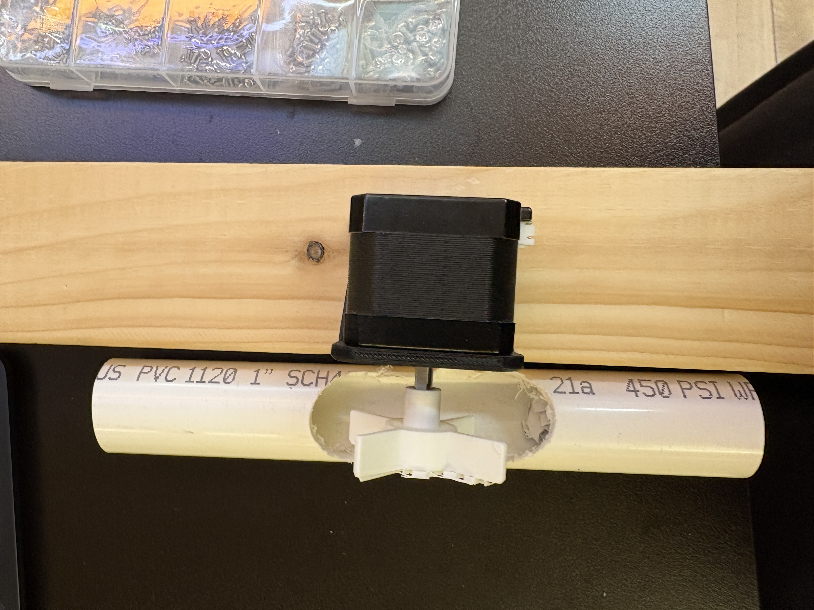

Gear prototype 2


Ball-dispensing mechanism prototype presented during my class’s playtest activated by the distance sensors


Self-standing prototype with mounted distance sensors

## Research and Prototypes

Now it’s time to build the nose! 

I drew inspiration from an Arduino powered candy vending machine that uses NEMA stepper motors and PVC pipes

[https://makezine.com/projects/build-an-arduino-powered-candy-vending-machine/](https://makezine.com/projects/build-an-arduino-powered-candy-vending-machine/)


### Frame + chicken wire + papier-mâché

I initially attempted to build the nose using cardboard with a folding technique called “Pepakura”. I laser cut fold-lines for one section of the nose but found this process to be very time-consuming and did not deliver the look I wanted. This likely means that I have a lot to improve in my paper-folding skill, but in the interest of time (less than 3 weeks for this project), I decided to pivot to other methods.


### More Prototypes

Leading up to the final "Intro to Physical Computing" in-class presentation, my instructor Pedro advised me to "focus on the bigger picture" and "focus on the interaction." This was helpful because my breadboard circuit had unexpectedly stopped working, forcing me to spend days debugging instead of fabricate the nose. With the bigger picture and interaction in mind, I let go of my ego and hid the internal components underneath a box with a cartoon drawing of a nose from Smooth Moves plastered on top. Though not aesthetically what I wanted to present, it achieved its purpose: a play-testable installation for my classmates to try and give feedback on. I received helpful feedback about the first impression my nose gives to participants, how they interact with it, and advice on fabricating the final version.


Back image of the mounting frame I built and the first box I used.

[IMG_0668 2.MOV](assets/IMG_0668_2.mp4)

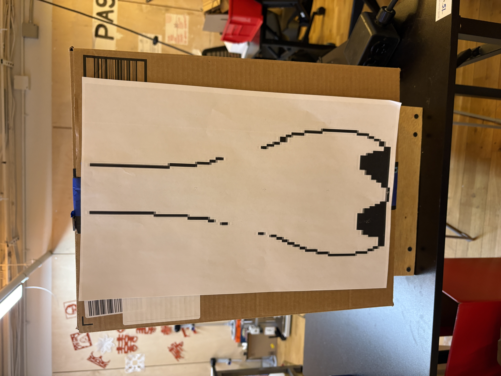

I found a slimmer box and cut holes at its bottom to allow the “boogers” (balls) to dispense

[IMG_0682 2.MOV](assets/IMG_0682_2.mp4)

### 3D Printing and CAD

Unsatisfied with the box prototypes, I viewed the week before my program's Winter Show as an opportunity to practice 3D modeling organic shapes. I had only modeled rigid geometric shapes before, so this was a chance to see how far I could push myself under a deadline. I started with Autodesk Fusion 360 but switched to Meshmixer, which handles organic shapes better. Fusion 360 interprets these shapes as having thousands of faces, causing it to crash repeatedly.

I also attended Advanced 3D printing trainings at the NYU Tandon Makerspace, where I learned to print with materials like TPU and resin, plus techniques for larger-scale printing, finer detail, and dissolvable supports. Ultimately, I printed with the standard Bambu X1 because quotes for a larger version of my nose model exceeded my budget. I downsized the nose to fit within the printer bed and the 12-hour printing time limit.

The 3D print wasn't perfect—the sides had holes because the walls were too thin for the slicer software to interpret. The inside wasn't completely hollowed out, so I made manual adjustments using a Dremel with a cutting blade. These are things I want to improve in the future with more time and experience.

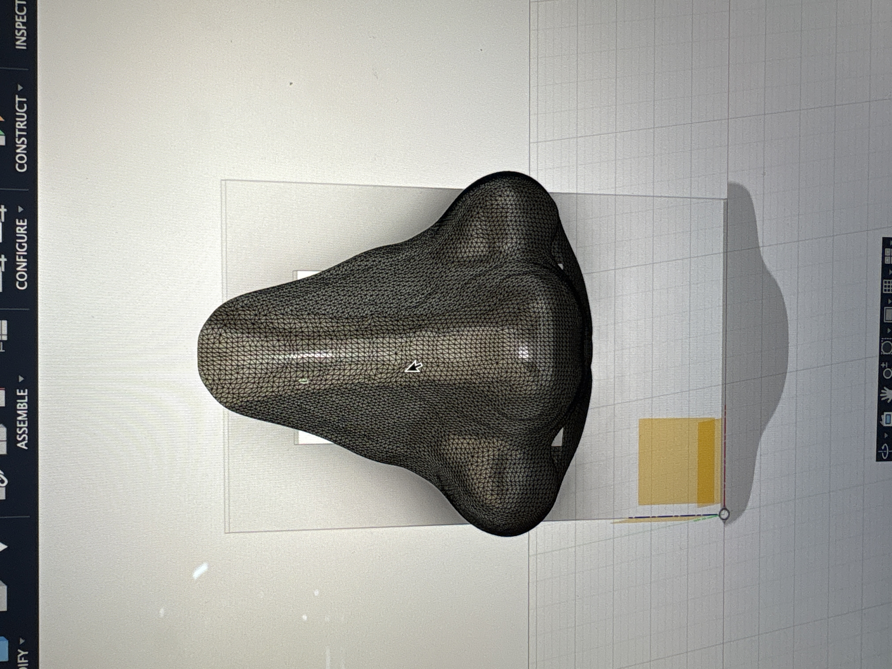


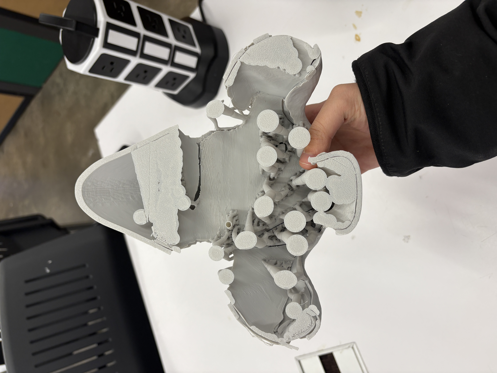


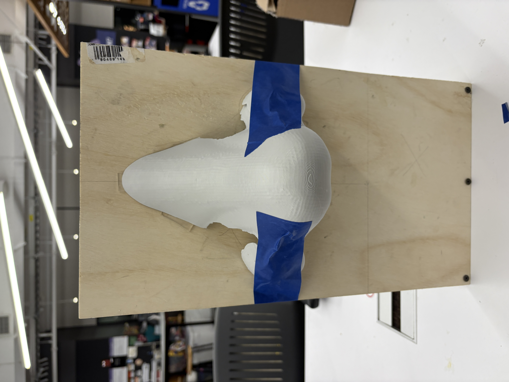

I didn't have time to build a proper enclosure for the breadboard circuit, so I hastily placed it in the back of the nose frame.

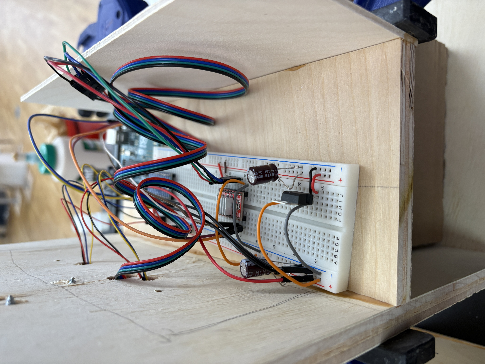

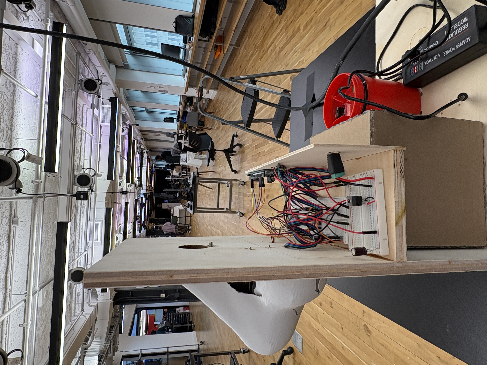

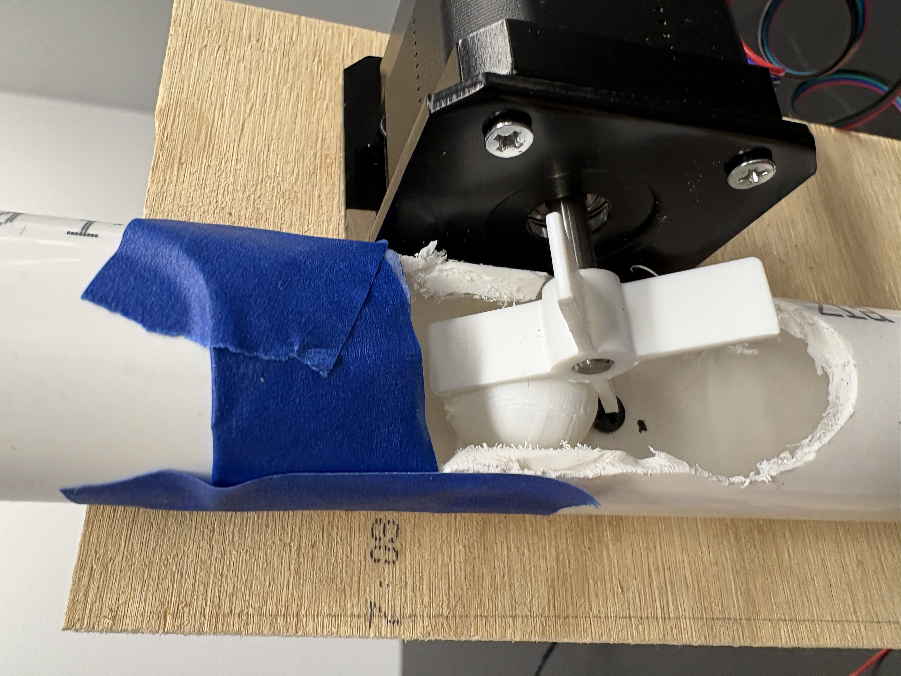

3D-printed balls inside the dispensing mechanism

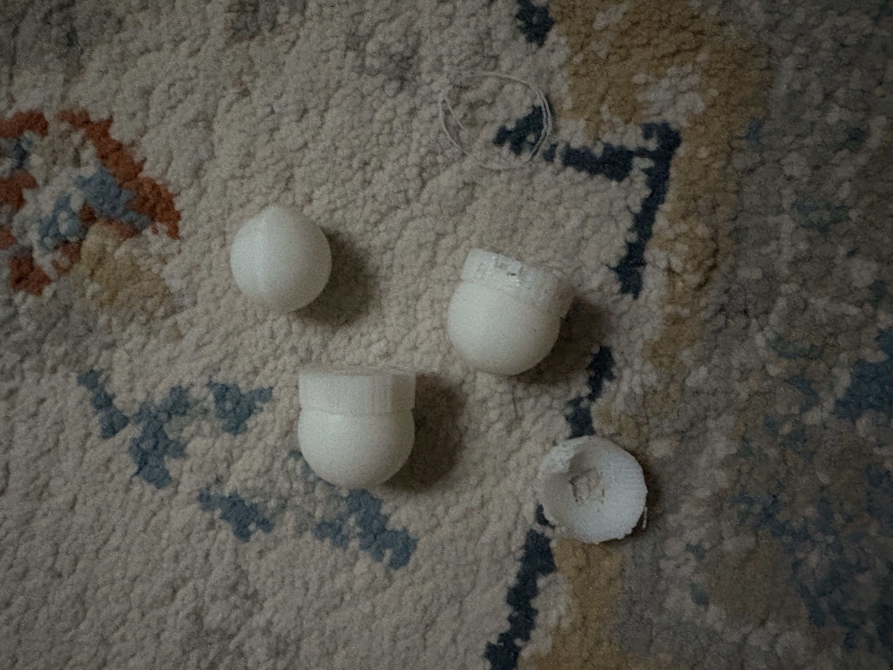

3D-printed balls 

### Aside: Biomaterials research

I wanted to make my nose with a realistic texture that resembled human skin. I attended a biomaterials workshop at NYU ITP and experimented with a DIY biomaterial recipe using agar agar power, vegetable glycerin, and apple cider vinegar. For the first iteration, it took at least 5 days for the biomaterial to fully cure, so I was not able to use it in my project in the interest of time. It is something I am keen to continue exploring though.

[https://itp.nyu.edu/courses/material/2023/10/30/agar-agar-cooking-show/](https://itp.nyu.edu/courses/material/2023/10/30/agar-agar-cooking-show/)


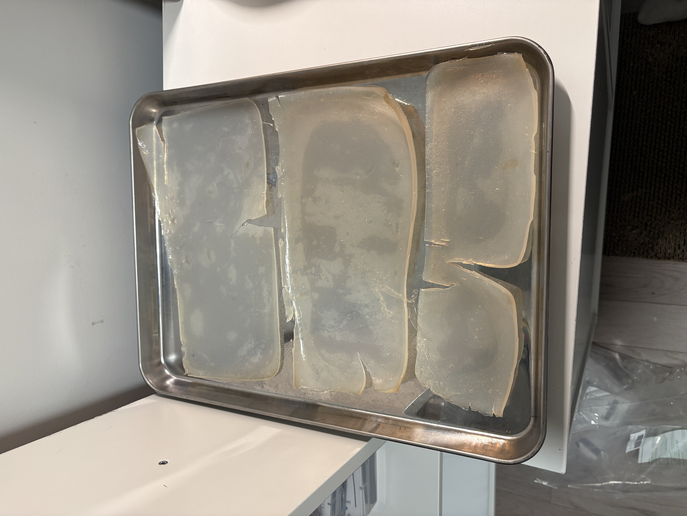

[IMG_0468 2.MOV](assets/IMG_0468_2.mp4)

# Code

```arduino
#include <Wire.h>

#define MULTIPLEXER_ADDR 0x70
#define SENSOR_ADDR 0x29

#define SENSOR1_CHANNEL 0
#define SENSOR2_CHANNEL 1

// VL6180X register addresses
#define VL6180X_IDENTIFICATION_MODEL_ID 0x0000
#define VL6180X_SYSRANGE_START 0x0018
#define VL6180X_RESULT_RANGE_STATUS 0x004D
#define VL6180X_RESULT_RANGE_VAL 0x0062
#define VL6180X_SYSTEM_INTERRUPT_CLEAR 0x0015

// Sensor settings
const int threshold = 40;

// Motor settings
const int dirPin = 2;
const int stepPin = 3;
const int sleepPin = 4;
const int resetPin = 5;
const int stepsPerRevolution = 200;

// State tracking
bool nosePickedState = false;

void selectMuxChannel(uint8_t channel) {
  if (channel > 7) return;
  Wire.beginTransmission(MULTIPLEXER_ADDR);
  Wire.write(1 << channel);
  Wire.endTransmission();
  delay(10);
}

void writeReg(uint16_t reg, uint8_t val) {
  Wire.beginTransmission(SENSOR_ADDR);
  Wire.write((reg >> 8) & 0xFF);
  Wire.write(reg & 0xFF);
  Wire.write(val);
  Wire.endTransmission();
}

uint8_t readReg(uint16_t reg) {
  Wire.beginTransmission(SENSOR_ADDR);
  Wire.write((reg >> 8) & 0xFF);
  Wire.write(reg & 0xFF);
  Wire.endTransmission();
  Wire.requestFrom(SENSOR_ADDR, 1);
  return Wire.read();
}

void spinMotor() {
  digitalWrite(dirPin, LOW);
  digitalWrite(sleepPin, HIGH);
  Serial.println("motor turned on");
  delay(100);
  
  // spin motor for 1/4 revolution
  for (int step = 0; step < stepsPerRevolution / 4; step++) {
    digitalWrite(stepPin, HIGH);
    delayMicroseconds(5000);
    digitalWrite(stepPin, LOW);
    delayMicroseconds(5000);    
  }
  
  digitalWrite(sleepPin, LOW);
  Serial.println("motor turned off");
}

void setup() {
  Serial.begin(9600);
  Wire.begin();
  
  // Motor setup
  pinMode(dirPin, OUTPUT);
  pinMode(stepPin, OUTPUT);
  pinMode(sleepPin, OUTPUT);
  pinMode(resetPin, OUTPUT);
  
  digitalWrite(dirPin, LOW);
  digitalWrite(stepPin, LOW);
  digitalWrite(sleepPin, LOW);
  digitalWrite(resetPin, HIGH);
  
  delay(2000);
  Serial.println("\n=== I2C Sensor Test ===\n");
  
  // Test 1: Scan for multiplexer
  Serial.println("Test 1: Looking for multiplexer at 0x70...");
  Wire.beginTransmission(MULTIPLEXER_ADDR);
  byte error = Wire.endTransmission();
  if (error == 0) {
    Serial.println("✓ Multiplexer found!");
  } else {
    Serial.println("✗ Multiplexer NOT found!");
    Serial.println("Check wiring and power. Halting.");
    while(1);
  }
  
  delay(500);
  
  // Test 2: Select channel 0 and look for sensor
  Serial.println("\nTest 2: Selecting channel 0 and looking for sensor at 0x29...");
  selectMuxChannel(SENSOR1_CHANNEL);
  Wire.beginTransmission(SENSOR_ADDR);
  error = Wire.endTransmission();
  if (error == 0) {
    Serial.println("✓ Sensor on channel 0 found!");
  } else {
    Serial.println("✗ Sensor on channel 0 NOT found!");
  }
  
  delay(500);
  
  // Test 3: Select channel 1 and look for sensor
  Serial.println("\nTest 3: Selecting channel 1 and looking for sensor at 0x29...");
  selectMuxChannel(SENSOR2_CHANNEL);
  Wire.beginTransmission(SENSOR_ADDR);
  error = Wire.endTransmission();
  if (error == 0) {
    Serial.println("✓ Sensor on channel 1 found!");
  } else {
    Serial.println("✗ Sensor on channel 1 NOT found!");
  }
  
  delay(500);
  
  // Test 4: Try to read sensor ID from channel 0
  Serial.println("\nTest 4: Reading sensor ID from channel 0...");
  selectMuxChannel(SENSOR1_CHANNEL);
  uint8_t id = readReg(VL6180X_IDENTIFICATION_MODEL_ID);
  Serial.print("Sensor ID: 0x");
  Serial.println(id, HEX);
  if (id == 0xB4) {
    Serial.println("✓ Valid VL6180X sensor!");
  } else {
    Serial.println("✗ Unexpected ID (may still work)");
  }
  
  delay(500);
  
  // Test 5: Try to read sensor ID from channel 1
  Serial.println("\nTest 5: Reading sensor ID from channel 1...");
  selectMuxChannel(SENSOR2_CHANNEL);
  id = readReg(VL6180X_IDENTIFICATION_MODEL_ID);
  Serial.print("Sensor ID: 0x");
  Serial.println(id, HEX);
  if (id == 0xB4) {
    Serial.println("✓ Valid VL6180X sensor!");
  } else {
    Serial.println("✗ Unexpected ID (may still work)");
  }
  
  Serial.println("\n=== Tests complete ===\n");
}

void loop() {
  // Read from both sensors continuously
  uint8_t range1, range2;
  
  selectMuxChannel(SENSOR1_CHANNEL);
  delay(10);
  writeReg(VL6180X_SYSRANGE_START, 0x01);
  delay(10);
  range1 = readReg(VL6180X_RESULT_RANGE_VAL);
  
  selectMuxChannel(SENSOR2_CHANNEL);
  delay(10);
  writeReg(VL6180X_SYSRANGE_START, 0x01);
  delay(10);
  range2 = readReg(VL6180X_RESULT_RANGE_VAL);
  
  Serial.print("Sensor 1 (Ch0): ");
  Serial.print(range1);
  Serial.print(" mm | Sensor 2 (Ch1): ");
  Serial.print(range2);
  Serial.println(" mm");
  
  // Check if both sensors detect below threshold
  if (range1 < threshold && range2 < threshold) {
    if (!nosePickedState) {
      Serial.println("nose picked!");
      spinMotor();
      nosePickedState = true;
    }
  } else {
    nosePickedState = false;
  }
  
  delay(500);
}
```

# Skills

- Arduino
- C++
- Autodesk Fusion 360
- Autodesk Meshmixer

- 3D printing
- Woodworking, power tools
- Soldering
- DIY Biomaterials

# Challenges

Throughout the project, I encountered several technical challenges that taught me valuable lessons. I initially purchased a cheap multiplexer that turned out to be broken, which delayed progress. I also learned the hard way about the importance of using the right power supply—using a switching power supply with inadequate current control led to a blown capacitor. I experimented with wire and foam for the nose structure, but these materials didn't achieve the aesthetic I was aiming for. Similarly, I attempted to create a bioplastic nose for a more realistic texture, but the curing time was too long to incorporate into the final project. Ultimately, limited time and the scope of my ambitions taught me how to better plan and scope projects for future iterations.

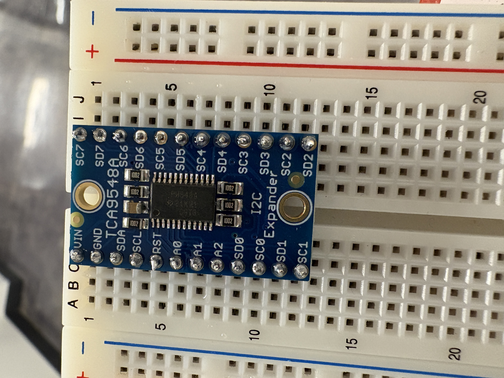

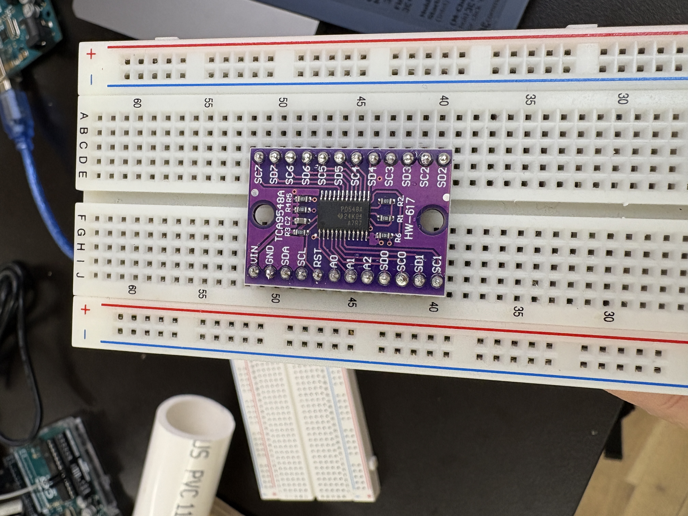

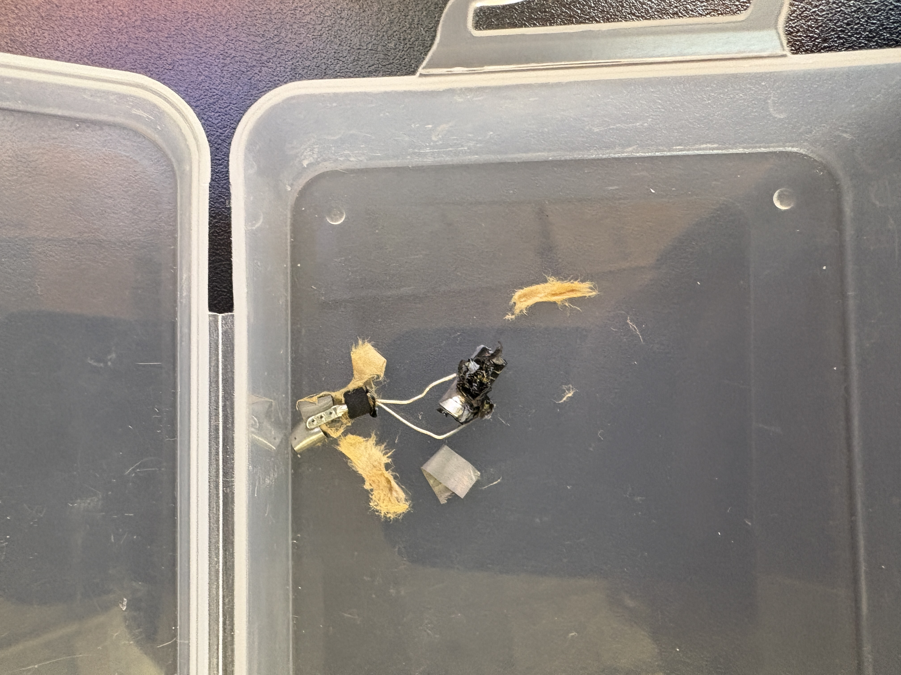


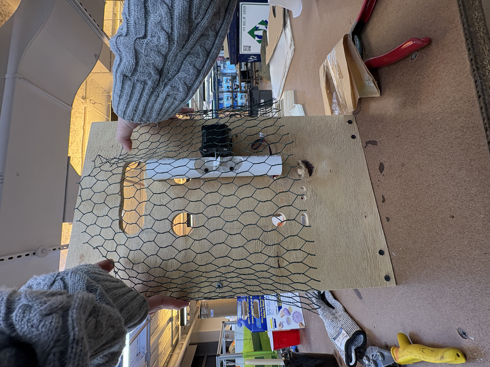

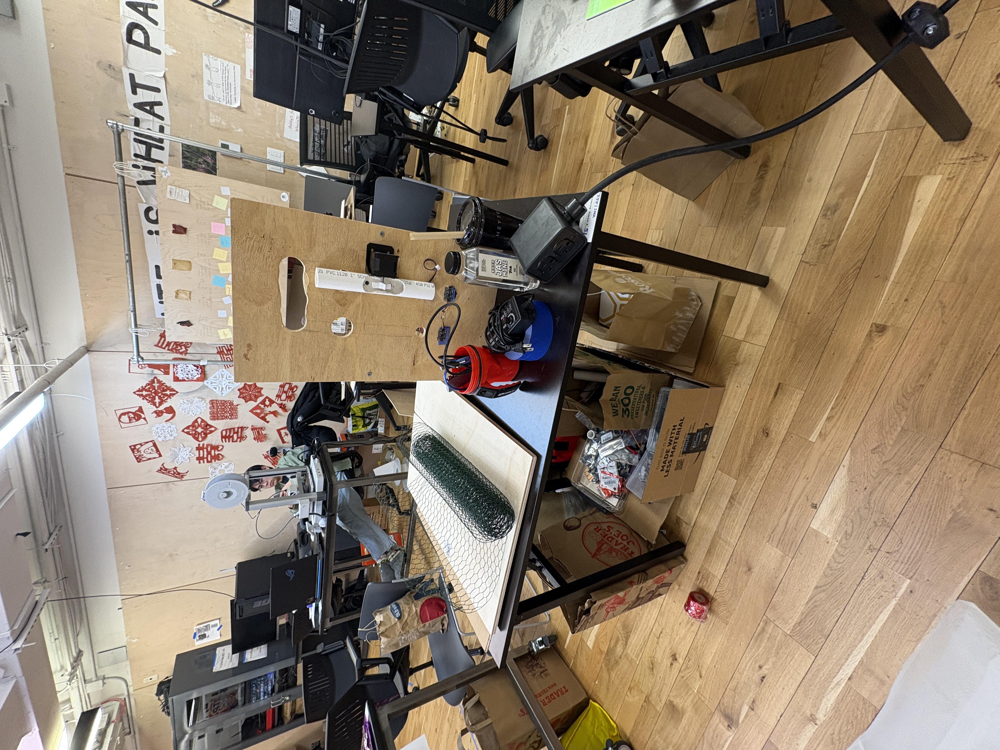

# Reflections

Leading up to the Winter Show exhibition, I was ready to give up on this project and never think about it again. Unexpectedly, presenting my work and seeing people from outside the program—from all sorts of backgrounds—interact with it and offer feedback gave me new energy and motivation to iterate and improve it further. 

# Looking Forward

Moving forward, I would like to solder the circuit onto a protoboard to create a more permanent and reliable setup that isn't prone to loose connections or melting the breadboard. I also envision building a more polished version of the nose that could be mounted on a wall within a decorative frame. Additionally, I'm excited to continue exploring biomaterials, CNC machining, silicone casting, and other fabrication methods to achieve a softer, more realistic-looking nose. Finally, I want to delve deeper into advanced 3D printing techniques to further refine the project.

I now see myself exploring this theme of noses in future classes, discovering the different forms they can take as I build skills across digital and physical mediums.