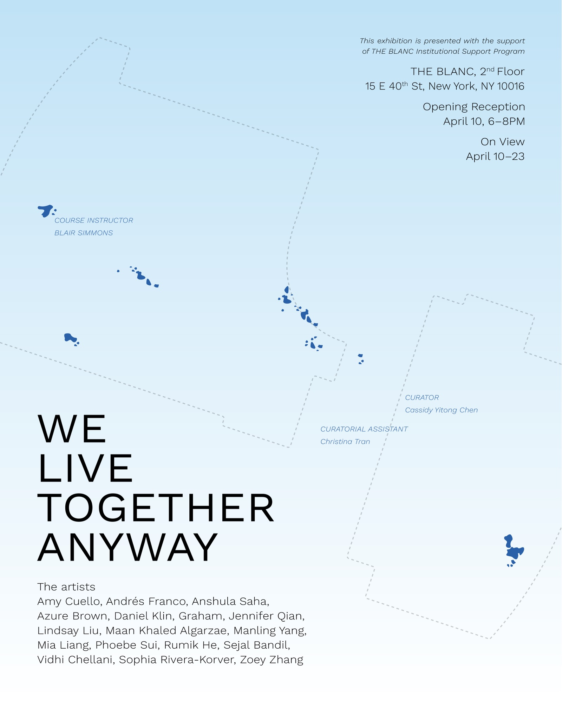

I was the curatorial assistant for this exhibition! 

It was my first time doing anything like this. I learned what it takes to coordinate with an institution like NYU and a gallery like THE BLANC, across faculty, staff, and students to pull off an art exhibition. I also learned quite a bit about installing large-scale artwork.

